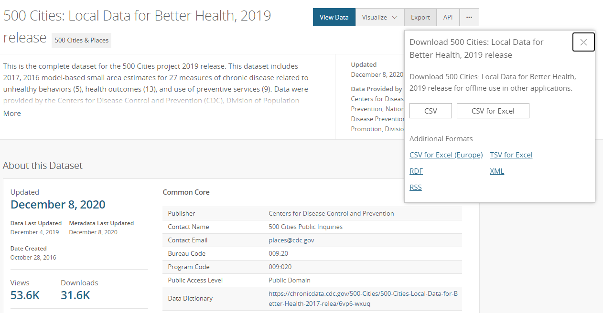
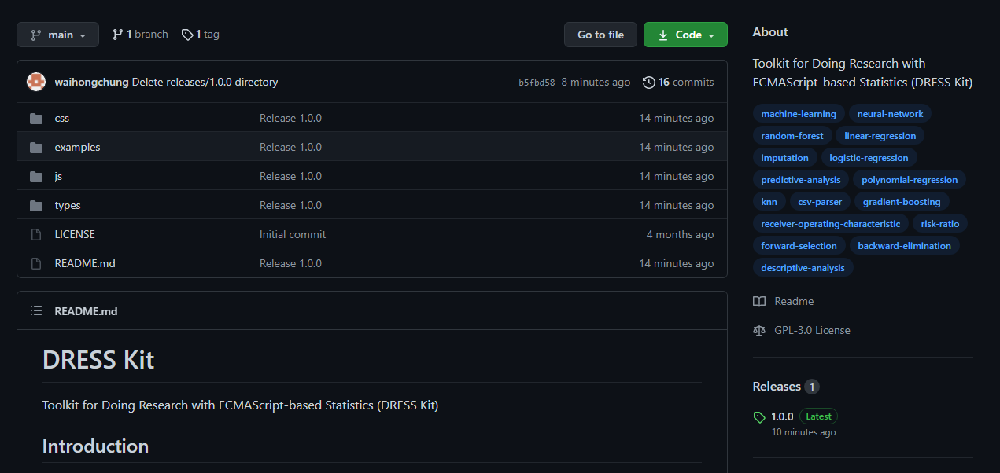
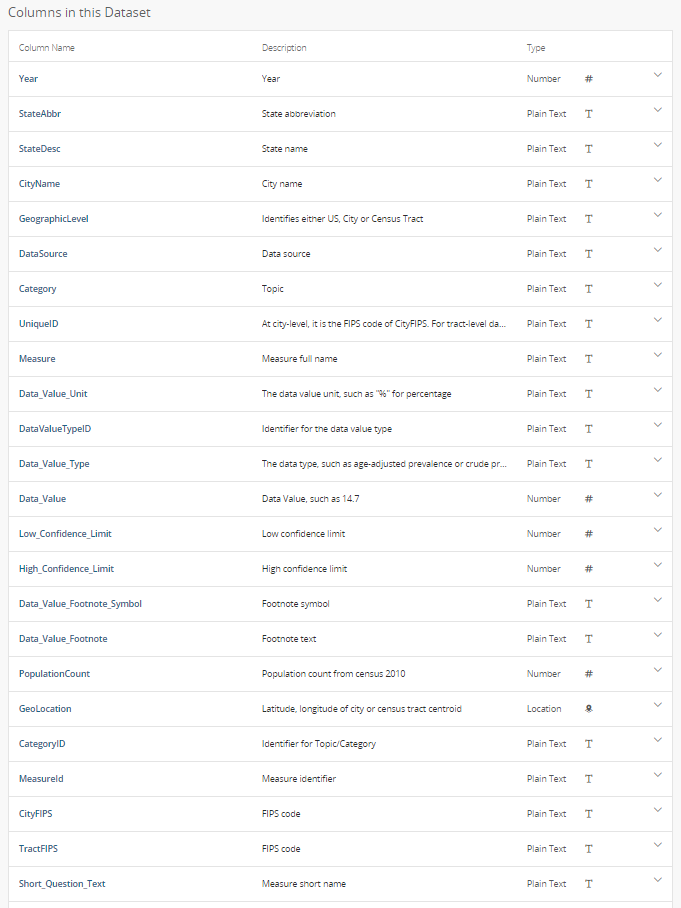

# Machine Learning in Medicine
### _A hands-on introductory course on machine learning techniques for physicians and healthcare professionals._

[](https://unsplash.com/s/photos/medical-computer?utm_source=unsplash&utm_medium=referral&utm_content=creditCopyText)
  
# Part I - Overview/Data Preparation

## Introduction
Machine Learning, deep learning, and artificial intelligence have become the latest buzzwords across all industries, including healthcare, over the past few years. There is a lot of optimism that machine learning can help physicians establish earlier and more accurate diagnoses and deliver more effective and personalized treatments for complex diseases, such as cancers. There is also hope that machine learning can be leveraged to increase the efficiency of healthcare delivery and reduce healthcare costs. 

Unfortunately, machine learning remains a relatively vague concept to most traditionally trained healthcare professionals. Only a small proportion is well-informed enough to critically evaluate journal articles on this subject, even fewer are able to take advantage of these techniques in their research. The goal of this introductory course is to demystify the black box of machine learning, to reveal the internal working of these algorithms, and to introduce the tools necessary to implement them.

While there is certainly no shortage of machine learning tutorials online, predicting [flower petal size](https://archive.ics.uci.edu/ml/datasets/Iris) and [housing price](https://www.cs.toronto.edu/~delve/data/boston/bostonDetail.html) is just not quite the same as diagnosing cancers. Therefore, in this course, we will be working on an actual clinical problem using a health outcome-related dataset. Along the way, we will try to highlight important decisions that one must consider while designing a clinical study using machine learning techniques.

## Prerequisites 
The target audience of this course includes medical students, physicians, and other healthcare professionals. It is assumed that the readers have a basic understanding of common statistics concepts (e.g. mean, standard deviation, confidence interval, coefficient of correlation) and are familiar with the process of formulating a clinical question. 

It is also assumed that the readers have an operational understanding of JavaScript programming (e.g. variable declaration, array manipulation, function invocation, etc). Although JavaScript programming is not a part of standard medical training, it is certainly one of the easiest programming languages for any beginners (they teach it to fifth and sixth graders). There are plenty of free introductory JavaScript courses online, including those from [Codecademy](https://www.codecademy.com/learn/introduction-to-javascript), [Learn-JS](https://www.learn-js.org/), and [Mozilla](https://developer.mozilla.org/en-US/docs/Web/JavaScript).

Finally, in order to follow along with the hands-on tutorials, the readers should have access to a modern JavaScript engine (e.g. [Google Chrome](https://www.google.com/chrome/index.html)) and a text editor (e.g. [Visual Studio Code](https://code.visualstudio.com) or [Brackets](http://brackets.io)).

## Course Content
- Part I - Overview/Data Preparation
- Part II - Data Exploration
- Part III - Linear/Logistic Regression
- Part IV - K-Nearest Neighbors
- Part V - Ensemble Decision Trees
- Part VI - Neural Networks
- Part VII - Hyperparameter Tuning

## Basic Terminologies
In this course, we will try to gloss over many of the boring theoretical aspects of machine learning and focus on the actual applications of machine learning techniques. It is important, however, to go over some basic terminologies so that we can understand how these different techniques relate to one another.

- Artificial Intelligence (AI)
: a simulation of natural intelligence using computer algorithms. Some of the aspects of natural intelligence being simulated by popular AI algorithms include visual perception, natural language recognition, and machine learning.

- Machine Learning (ML)
: a subdomain within the field of artificial intelligence that focuses on building models to represent real-world knowledge and experiences. Various machine learning techniques have been devised and they can be broadly divided into supervised learning, unsupervised learning, and semi-supervised learning.

- Supervised Learning
: a group of machine learning techniques that model the relationship between an input and an output by analyzing a set of training examples. Examples of supervised learning techniques include linear/logistic regression, decision trees, k-nearest neighbors, and neural networks.

- Unsupervised Learning
: a group of machine learning techniques that identify patterns from _unlabeled_ data based on self-organization. Examples of unsupervised learning techniques include principal component analysis, cluster analysis, and neural networks.

- Neural Network (NN)
: also known as artificial neural network (ANN), a machine learning technique that mimics biological neural networks. A neural network is generally made up of a collection of interconnected nodes, which loosely mimic the neurons in a biological neural network.

- Deep Learning
: a group of machine learning techniques based on neural networks that use multiple layers and large numbers of neurons in order to achieve a higher level of abstraction.

## Project Setup
Throughout this course, we will be exploring a public domain dataset called the [500 Cities: Local Data for Better Health, 2019 release](https://chronicdata.cdc.gov/500-Cities-Places/500-Cities-Local-Data-for-Better-Health-2019-relea/6vp6-wxuq) made available by the Centers for Disease Control and Prevention (CDC). This dataset includes estimates for 27 measures of chronic disease related to unhealthy behaviors (5), health outcomes (13), and use of preventive services (9) from the 500 largest US cities and approximately 28,000 census tracts within these cities. 

We will also be using an open-source JavaScript library called [Toolkit for Doing Research with ECMAScript-based Statistics (DRESS Kit)](https://github.com/waihongchung/dress) to actually create our machine learning models in JavaScript. This library is written in plain JavaScript and can be run, without any special software, on any computer equipped with a modern browser. It has a much shallower learning curve compares to other popular machine learning libraries, such as [Keras](https://keras.io) or [TensorFlow](https://www.tensorflow.org), yet it is reasonably fast and powerful.

To get ready for the subsequent parts of the course, the readers should complete the following tasks:

1. Create a project folder.

2. Download the [500 Cities: Local Data for Better Health, 2019 release](https://chronicdata.cdc.gov/500-Cities-Places/500-Cities-Local-Data-for-Better-Health-2019-relea/6vp6-wxuq) from the CDC website. Click on the **Export** button on the top right corner and then the **CSV** button. Save the file as `data.csv` in a separate folder `/data` within the project folder.
    

3. Download the [DRESS Kit](https://github.com/waihongchung/dress) from GitHub. Click on the **Releases** section on the right and then download **dress.zip** from release **1.0.0**. Copy the `/js` folder and the `/css` folder from the ZIP file to the project folder.
    

At this point, you should have the following files/folders within your project folder:
```
[project]
|__[data]
|  |__data.csv
|__[js]
|  |__dress.min.js
|__[css]
   |__dress.min.css
```

## Data Preparation
The first step in the data analysis process of any research project, whether it is related to machine learning or not, is data preparation. This means sanitizing the dataset, removing unnecessary or erroneous data, and converting the data file into a format that is compatible with the data analysis tools being used.

The entire 500 Cities dataset is over 200MB and contains 810,000 rows of data and 24 columns, many of which are redundant. We will trim the dataset down by eliminating unwanted rows and columns. We start by inspecting the Data Dictionary associated with the dataset. We can see that the dataset contains data points for each of the 28,000 census tracts as well as the 500 largest US cities and the US as a whole. For the purpose of our research project, we want to consider each of the census tracts as a separate study subject. We will ignore those city-level and national-level data points. We can also see that the dataset contains both crude prevalence and age-adjusted prevalence for each data point. We will use crude prevalence for the purpose of this project.



1. Create a new HTML file named `part1_1.htm` within the project folder by copying the following code:
    ```html
    <!DOCTYPE html>
    <html lang="en">
    <head>
        <title>Part 1.1 - CSV Conversion</title>
        <script type="text/javascript" src="js/dress.min.js"></script>        
        <link type="text/css" rel="stylesheet" href="css/dress.min.css" />
    </head>
    <body>
        <script type="text/javascript" src="part1_1.js"></script>
    </body>
    </html>
    ```
    This HTML file simply loads the necessary JavaScript library from the DRESS Kit as well as our own JavaScript file.

2. Create a new JavaScript file named `part1_1.js` within the project folder by copying the following code:
    ```javascript
    // Open the 'data.csv' file stored on the local machine.
    DRESS.local('data.csv', processCSV, false);

    function processCSV(csv) {
        // Convert dataset from the CSV format to a JavaScript array.
        let array = DRESS.fromCSV(csv);
        // Filter rows by GeograhicLevel and select only those labeled 'Census Tract'.
        array = array.filter(row => row.GeographicLevel === 'Census Tract');
        // Filter rows by Data_Value_Type and select only those labeled 'Crude prevalence'.
        array = array.filter(row => row.Data_Value_Type === 'Crude prevalence');
    }
    ```
    Let's go through the JavaScript code in detail. We start by loading the `data.csv` file using a function called `DRESS.local`. This function does not actually load the file automatically, but it displays a [File Input](https://developer.mozilla.org/en-US/docs/Web/HTML/Element/input/file) element on the HTML file. After a user clicks on the File Input and selects the appropriate file, the callback function `processCSV` is called. The last parameter is set to `false` so that the `DRESS.local` function will not attempt to parse the content as a [JSON](https://developer.mozilla.org/en-US/docs/Web/JavaScript/Reference/Global_Objects/JSON) file. The content of the `data.csv` file (the entire 500 Cities dataset) is passed to the `processCSV` function as a parameter named `csv`.
    
    Next, we need to convert the dataset from the [CSV](https://en.wikipedia.org/wiki/Comma-separated_values) format to a native JavaScript array. Fortunately, the DRESS Kit comes with a neat little function designed just for this purpose and it's conveniently named `DRESS.fromCSV`. We simply pass the `csv` variable to the function as a parameter and, voilà, out comes the dataset as an array of objects.

    Afterward, we filter the array by selecting only rows that contain census tract level data and crude prevalence data. As we can see, one of the neat things that the `DRESS.fromCSV` does is converting each row of the CSV file into a separate JavasScript object. We can access each data point directly as a property of the object using the corresponding header as the property name, for instance `row.GeographicLevel`.

3. As mentioned above, we would like to consider each census tract as a subject in our study. Ideally, we would like each subject to be represented by one object. Unfortunately, each of those 27 measures of chronic disease is recorded in a separate row in the dataset. We will need a way to combine these 27 measures for each census tract into one object. Such a task would be very difficult if we were to process the dataset in other prebuilt statistical software, but because we are working in a programmable environment, we can easily accomplish this with a few lines of code.
    ```javascript
    const subjects = new Map();
    // Loop through each row.
    array.forEach(row => {
        const id = row.UniqueID;
        // Get the subject by its UniqueID. If it does not exist yet, create a new one.
        const subject = subjects.get(id) || {
            id,
            state: row.StateDesc,
            city: row.CityName,
            population: +row.PopulationCount
        }
        // Create a new property using the MeasureId as name.
        subject[row.MeasureId] = +row.Data_Value;
        subjects.set(id, subject);
    });
    // Save the array of subjects as a JSON file.
    DRESS.save(Array.from(subjects.values()), 'data.json');
    ```
    Since we know that each census tract is identified by a unique identifier, we can use it to group related data points into one object. We also use this opportunity to discard those unnecessary columns. Next, we want to convert the numerical values, such as `PopulationCount` and `Data_Value` into numbers, which can easily be accomplished in JavaScript by prefixing the variables with a `+` sign. Finally, we want to save the array of newly created subjects to a file for future use. This can be accomplished easily using the `DRESS.save` function by passing the content and a file name as parameters.

4. If we run the code as is, it is like to cause a Long-Running Script error. Despite its efficiency, processing over 200MB of data using JavaScript is going to take a certain amount of time. To prevent the browser window from freezing up, we will take advantage of another cool little function named `DRESS.async`, which allows any functions within the DRESS Kit to be executed asynchronously. The function returns a [Promise](https://developer.mozilla.org/en-US/docs/web/javascript/reference/global_objects/promise), which will eventually resolve to the output of the asynchronously executed function. We can pass the Promise to another function called `DRESS.print`, which is used to display text on the HTML, in order to display a timer as the dataset is being processed. 

    Here is the final code:
    ```javascript
    // Open 'data.csv' stored on the local machine.
    DRESS.local('data.csv', processCSV, false);

    function processCSV(csv) {
        DRESS.print(
            // Convert dataset from the CSV format to a JavaScript array.
            DRESS.async('DRESS.fromCSV', csv).then(array => {
                // Filter rows by GeograhicLevel and select only those labeled 'Census Tract'.
                array = array.filter(row => row.GeographicLevel === 'Census Tract');
                // Filter rows by Data_Value_Type and select only those labeled 'Crude prevalence'.
                array = array.filter(row => row.Data_Value_Type === 'Crude prevalence');

                const subjects = new Map();
                // Loop through each row.
                array.forEach(row => {
                    const id = row.UniqueID;
                    // Get the subject by its UniqueID. If it does not exist yet, create a new one.
                    const subject = subjects.get(id) || {
                        id,
                        state: row.StateDesc,
                        city: row.CityName,
                        population: +row.PopulationCount
                    };
                    // Create a new property using the MeasureId as name.
                    subject[row.MeasureId] = +row.Data_Value;
                    subjects.set(id, subject);
                });
                // Save the array of subjects as a JSON file.
                DRESS.save(Array.from(subjects.values()), 'data.json');
            })
        );
    }
    ```
    Open `part1_1.htm` in the browser, click on the File Input button, select the `data.csv` file, and finally, save the `data.json` file in the `/data` folder within the project folder.

## Wrap Up
Let's review what we have learned in Part I. We went over some basic terminologies related to machine learning. In particular, we introduced the names of several common machine learning algorithms, such as decision trees, k-nearest neighbors, and neural networks, and discussed how they fit into one another. We proceeded to set up our project by downloading the 500 Cities dataset and setting up the DRESS Kit. We went through the data preparation process to extract useful data points from our dataset. Along the way, we learned several basic functions from the DRESS Kit, including `DRESS.local` (to load a local file), `DRESS.save` (to save a file to your local machine), `DRESS.fromCSV` (to convert a CSV file to native JavaScript objects), `DRESS.print` (to print text onto the HTML), and `DRESS.async` (to execute a function asynchronously).

We haven't really done anything remotely related to machine learning yet, but that is forthcoming in the subsequent parts of this course. Stay tuned.

## Exercise
As an exercise, the readers can try to prepare another JSON file containing data that the city-level, instead of the census tract-level. 


