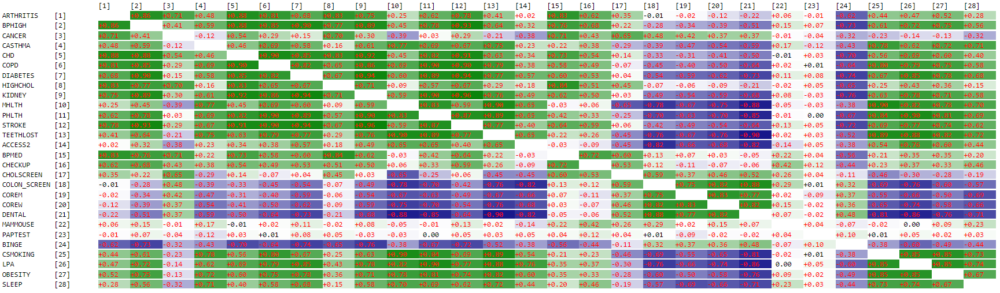

# Machine Learning in Medicine
### _A hands-on introductory course on machine learning techniques for physicians and healthcare professionals._

[](https://unsplash.com/photos/_Jb1TF3kvsA/info)
  
# Part II - Data Exploration

## Recap
In [Part I](part1.md) of this course, we introduced the names of several common machine learning algorithms, such as decision trees, k-nearest neighbors, and neural networks, and discussed how they fit into one another. We proceeded to set up our project by downloading a public domain dataset, the [500 Cities dataset](https://chronicdata.cdc.gov/500-Cities-Places/500-Cities-Local-Data-for-Better-Health-2019-relea/6vp6-wxuq) and setting up a JavaScript machine learning library called the [DRESS Kit](https://github.com/waihongchung/dress). Next, We went through the data preparation process to extract useful data points from the dataset using several basic functions from the DRESS Kit, including `DRESS.local` (to load a local file), `DRESS.save` (to save a file to your local machine), `DRESS.fromCSV` (to convert a CSV file to native JavaScript objects), `DRESS.print` (to print text onto the HTML), and `DRESS.async` (to execute a function asynchronously). At the end of Part I, we created a JSON file `data.json` containing only the census tract-level crude prevalence data from the 500 Cities dataset from those census tracks with a population count of at least 50. We also create a JSON file `measures.json` which groups the `MeasureId` by `Category` and maps each `MeasureId` from the original dataset to its definition.

Just as a point of reference, here is the content of `measures.json`.
```javascript
{
    "Health Outcomes": {
        "ARTHRITIS": "Arthritis among adults aged >=18 Years",
        "DIABETES": "Diagnosed diabetes among adults aged >=18 Years",
        "STROKE": "Stroke among adults aged >=18 Years",
        "BPHIGH": "High blood pressure among adults aged >=18 Years",
        "TEETHLOST": "All teeth lost among adults aged >=65 Years",
        "CHD": "Coronary heart disease among adults aged >=18 Years",
        "CASTHMA": "Current asthma among adults aged >=18 Years",
        "KIDNEY": "Chronic kidney disease among adults aged >=18 Years",
        "COPD": "Chronic obstructive pulmonary disease among adults aged >=18 Years",
        "MHLTH": "Mental health not good for >=14 days among adults aged >=18 Years",
        "PHLTH": "Physical health not good for >=14 days among adults aged >=18 Years",
        "HIGHCHOL": "High cholesterol among adults aged >=18 Years who have been screened in the past 5 Years",
        "CANCER": "Cancer (excluding skin cancer) among adults aged >=18 Years"
    },
    "Prevention": {
        "MAMMOUSE": "Mammography use among women aged 50-74 Years",
        "CHOLSCREEN": "Cholesterol screening among adults aged >=18 Years",
        "CHECKUP": "Visits to doctor for routine checkup within the past Year among adults aged >=18 Years",
        "PAPTEST": "Papanicolaou smear use among adult women aged 21-65 Years",
        "COREM": "Older adult men aged >=65 Years who are up to date on a core set of clinical preventive services: Flu shot past Year, PPV shot ever, Colorectal cancer screening",
        "DENTAL": "Visits to dentist or dental clinic among adults aged >=18 Years",
        "ACCESS2": "Current lack of health insurance among adults aged 18-64 Years",
        "BPMED": "Taking medicine for high blood pressure control among adults aged >=18 Years with high blood pressure",
        "COLON_SCREEN": "Fecal occult blood test, sigmoidoscopy, or colonoscopy among adults aged 50-75 Years",
        "COREW": "Older adult women aged >=65 Years who are up to date on a core set of clinical preventive services: Flu shot past Year, PPV shot ever, Colorectal cancer screening, and Mammogram past 2 Years"
    },
    "Unhealthy Behaviors": {
        "OBESITY": "Obesity among adults aged >=18 Years",
        "CSMOKING": "Current smoking among adults aged >=18 Years",
        "BINGE": "Binge drinking among adults aged >=18 Years",
        "SLEEP": "Sleeping less than 7 hours among adults aged >=18 Years",
        "LPA": "No leisure-time physical activity among adults aged >=18 Years"
    }
}
```

## DRESS Kit Update
Before proceeding with the rest of this course, please take a moment to update the [DRESS Kit](https://github.com/waihongchung/dress) to release **1.1.0**. This version contains several performance improvements as well as a few new features, including generating histograms and heatmaps, that we are going to explore during this part of the course.

## Histogram
We begin the data exploration process by performing basic descriptive analysis of the dataset so that we can get a rough idea of the *quality* of the available data. In particular, we want to pay attention to the presence of any missing or erroneous data points, the relative ranges of the numerical features (do we need to normalize/standardize these features?), the dimensions of the categorical features (is it feasible to do [one-hot encoding](https://en.wikipedia.org/wiki/One-hot) on these features?), and the distributions of these features (normal, uniform, skewed, etc.)

Once again, we create a boilerplate HTML file named `part2_1.htm` that loads the DRESS Kit as well as our custom JavaScript file `part2_1.js`.
```html
<!DOCTYPE html>
<html lang="en">
<head>
    <title>Part 2.1 - Descriptive Analysis</title>
    <script type="text/javascript" src="js/dress.min.js"></script>        
    <link type="text/css" rel="stylesheet" href="css/dress.min.css" />
</head>
<body>
    <script type="text/javascript" src="part2_1.js"></script>
</body>
</html>
```

```javascript
// Load the 'data.json' file stored on the local machine.
DRESS.local('data.json', processJSON);

function processJSON(subjects) {
    // Crete an array containing all 27 measures of chronic disease.
    const measures = ['ARTHRITIS', 'BPHIGH', 'CANCER', 'CASTHMA', 'CHD', 'COPD', 'DIABETES', 'HIGHCHOL', 'KIDNEY', 'MHLTH', 'PHLTH', 'STROKE', 'TEETHLOST',
        'ACCESS2', 'BPMED', 'CHECKUP', 'CHOLSCREEN', 'COLON_SCREEN', 'COREM', 'COREW', 'DENTAL', 'MAMMOUSE', 'PAPTEST', 'BINGE', 'CSMOKING', 'LPA', 'OBESITY', 'SLEEP'];

    DRESS.print(
        // Create a list of histograms, one for each measure.
        DRESS.histograms(subjects, measures)
    )
}
```
We load the dataset created during Part I of the course using the `DRESS.local` function. Notice that the third parameter is no longer set to `FALSE` because the dataset is now stored in the [JSON](https://developer.mozilla.org/en-US/docs/Web/JavaScript/Reference/Global_Objects/JSON) format, which can be parsed natively by JavaScript. We assign all the 27 measures of chronic disease into an array so that we don't have to type them over and over again. One of the most popular and straightforward data exploration techniques used by data scientists are [histogram](https://en.wikipedia.org/wiki/Histogram#Cumulative_histogram). It describes the distribution of the values in the dataset in a concise and intuitive manner. While there are plenty of statistical software packages that can generate high-quality multi-color histograms, there are really not necessary because the whole idea of a histogram is that it represents an *approximation* of the underlying dataset. We can gather all the information we need from the rough outline of a histogram, which we can generate using the `DRESS.histograms` function.

Open `part2_1.htm` in the browser, click on the File Input button, select the `data.json` file to generate a list of text-based histograms. Here are three of those histograms generated by the function. 
```
CANCER      : 27204 (100.00%)
0.70    |#         |    903 (3.32%)
2.92    |######### |    10517   (38.66%)
5.14    |##########|    11866   (43.62%)
7.36    |###       |    3260    (11.98%)
9.58    |          |    471 (1.73%)
11.80   |          |    101 (0.37%)
14.02   |          |    38  (0.14%)
16.24   |          |    32  (0.12%)
18.46   |          |    9   (0.03%)
20.68   |          |    7   (0.03%)

BPMED       : 27204 (100.00%)
9.60    |          |    29  (0.11%)
17.92   |          |    66  (0.24%)
26.24   |          |    65  (0.24%)
34.56   |          |    109 (0.40%)
42.88   |          |    219 (0.81%)
51.20   |#         |    1184    (4.35%)
59.52   |#####     |    6458    (23.74%)
67.84   |##########|    12715   (46.74%)
76.16   |#####     |    6080    (22.35%)
84.48   |          |    279 (1.03%)

COREW       : 27095 (99.60%)
9.60    |          |    62  (0.23%)
14.15   |###       |    1541    (5.66%)
18.70   |#######   |    4109    (15.10%)
23.25   |######### |    5294    (19.46%)
27.80   |##########|    5734    (21.08%)
32.35   |##########|    5591    (20.55%)
36.90   |######    |    3351    (12.32%)
41.45   |##        |    1189    (4.37%)
46.00   |          |    208 (0.76%)
50.55   |          |    16  (0.06%)
```
Each histogram provides several key pieces of information. First, it displays the number (and percentage) of data points that contain a non-null value. We can see that there are no null values for the `CANCER` and `BPMED` measures, but a small portion (0.4%) of data points is missing from the `COREW` measure. Next, it calculates the ranges of values (the first bar represents the minimum, the difference between the bars represents the interval, and the last bar represents the maximum - interval). For instance, we can see that the range for the `CANCER` measure is between 0.7 and 22.9. Most importantly, we can see the rough distribution of values from the bar graphs. We can see that the `CANCER` measure is skewed heavily towards the left, while the `BPMED` measure is skewed heavily towards the right. In comparison, the `COREW` measure is nearly evenly distributed around the mean.

The `DRESS.histograms` function can also generate histograms from categorical features. Simply pass the names of the categorical feature as the third parameter, as followed:
```javascript
// Pass an array of categorical features as the third parameter.
DRESS.histograms(subjects, null, ['state'])
```

```
state: 27204    (100.00%)
Alabama       |#         |  345 (1.27%)
Alaska        |          |  55  (0.20%)
Arizona       |##        |  1000    (3.68%)
Arkansas      |          |  118 (0.43%)
California    |##########|  5237    (19.25%)
Colorado      |#         |  684 (2.51%)
Connecticut   |          |  220 (0.81%)
Delaware      |          |  24  (0.09%)
District of C |          |  178 (0.65%)
Florida       |##        |  1295    (4.76%)
Georgia       |#         |  444 (1.63%)
Hawaii        |          |  234 (0.86%)
Idaho         |          |  67  (0.25%)
Illinois      |##        |  1285    (4.72%)
Indiana       |#         |  514 (1.89%)
Iowa          |          |  190 (0.70%)
Kansas        |#         |  298 (1.10%)
Kentucky      |#         |  262 (0.96%)
Louisiana     |#         |  369 (1.36%)
Maine         |          |  20  (0.07%)
Maryland      |          |  199 (0.73%)
Massachusetts |#         |  484 (1.78%)
Michigan      |#         |  724 (2.66%)
Minnesota     |#         |  310 (1.14%)
Mississippi   |          |  75  (0.28%)
Missouri      |#         |  427 (1.57%)
Montana       |          |  43  (0.16%)
Nebraska      |          |  214 (0.79%)
Nevada        |#         |  358 (1.32%)
New Hampshire |          |  47  (0.17%)
New Jersey    |#         |  304 (1.12%)
New Mexico    |          |  206 (0.76%)
New York      |#####     |  2462    (9.05%)
North Carolin |#         |  764 (2.81%)
North Dakota  |          |  25  (0.09%)
Ohio          |##        |  821 (3.02%)
Oklahoma      |#         |  460 (1.69%)
Oregon        |#         |  336 (1.24%)
Pennsylvania  |#         |  631 (2.32%)
Rhode Island  |          |  98  (0.36%)
South Carolin |          |  167 (0.61%)
South Dakota  |          |  56  (0.21%)
Tennessee     |#         |  510 (1.87%)
Texas         |######    |  2961    (10.88%)
Utah          |          |  233 (0.86%)
Vermont       |          |  11  (0.04%)
Virginia      |#         |  499 (1.83%)
Washington    |#         |  503 (1.85%)
West Virginia |          |  22  (0.08%)
Wisconsin     |#         |  399 (1.47%)
Wyoming       |          |  16  (0.06%)
```
We can see that data points from California, New York, and Texas made up the majority of the dataset, which is not entirely unexpected given the population distribution of the United States. It is important to remember that each `subject` in this dataset refers to a census tract, not an individual. It is also worth noting that certain states, such as Delaware, Maine, Vermont, West Virginia, and Wyoming, have very few census tracts and may create some problems when we actually use the dataset to build our machine learning models. We need to keep this in mind.

## Imputation
Notice that certain features, such as the `COREW` measure, in the dataset contain missing data points. Missing data is a fairly common problem during clinical research; participants may drop out in the middle of the study, data may have been entered incorrectly, or data collection forms may have been misplaced. This is the point in most statistic textbooks where they bring up the concepts of [Missing At Random](https://en.wikipedia.org/wiki/Missing_data#Missing_at_random) (MAR), [Missing Completely At Random](https://en.wikipedia.org/wiki/Missing_data#Missing_completely_at_random) (MCAR), and [Missing Not At Random](https://en.wikipedia.org/wiki/Missing_data#Missing_not_at_random) (MNAR). We are not going to waste time discussing the boring theoretical stuff behind these definitions. Suffice to say that MCAR does not affect data analysis but, in reality, it is almost impossible to prove that data is missing *completely 100%* at random. MNAR is the exact opposite situation, in which the reason the data is missing is related to the value of the missing data. The only way to reliably recover the missing data is to address the underlying reason by modifying the data collection step or the data analysis step. For instance, in an online survey that asks about the number of hours spent on the computer, it is likely that those without computer access (or at least internet access)  would not be represented in the dataset. The researcher should either attempt to collect the data in person or acknowledge during the analysis that the study is limited only to those who can access the survey online. No one-size-fit-all statistical manipulations can resolve MNAR. 
In most well-designed clinical studies, we are dealing with MAR, which can be addressed through some sort of statistical method. One strategy is to ignore those missing data points. We can either discard the whole subject or just the missing data point depending on how we want to analyze the data. The second strategy is to replace the missing data with a reasonable estimate, a process known as imputation. Such an estimate can be computed by randomly selecting a data point from other non-missing data points (e.g. Last Observation Carried Forward or Base Observation Carried Forward), by calculating the arithmetic mean or mode, or by some sort of statistical regression analysis.

We will demonstrate some basic imputation techniques when it is time for us to actually build our machine learning models. And we will also learn that some of the machine learning techniques can, in turn, be used an imputation technique.

## Mean, Median, and Mode
Another way to explore the data more analytically is to study the dataset's [central tendency](https://en.wikipedia.org/wiki/Central_tendency) (mean, median, and mode) and [dispersion](https://en.wikipedia.org/wiki/Statistical_dispersion) (variance and interquartile range). These properties are especially important because many other statistical methods, such as regression analysis, operate on them and we often perform comparisons between two or more datasets using these properties (i.e. does the treatment group have a higher *average* survival rate than the placebo group).

Naturally, the DRESS Kit comes with several built-in functions to compute the central tendency and dispersion of a dataset. 
```javascript
// Load the 'data.json' file stored on the local machine.
DRESS.local('data.json', processJSON);

function processJSON(subjects) {
    // Crete an array containing all 27 measures of chronic disease.
    const measures = ['ARTHRITIS', 'BPHIGH', 'CANCER', 'CASTHMA', 'CHD', 'COPD', 'DIABETES', 'HIGHCHOL', 'KIDNEY', 'MHLTH', 'PHLTH', 'STROKE', 'TEETHLOST',
        'ACCESS2', 'BPMED', 'CHECKUP', 'CHOLSCREEN', 'COLON_SCREEN', 'COREM', 'COREW', 'DENTAL', 'MAMMOUSE', 'PAPTEST', 'BINGE', 'CSMOKING', 'LPA', 'OBESITY', 'SLEEP'];

    DRESS.print(
        // Calculate means
        DRESS.means(subjects, measures),
        // Calculate medians
        DRESS.medians(subjects, measures),
        // Calculate frequencies of distribution
        DRESS.frequencies(subjects, ['state'])
    )
}
```
Here again is a portion of the results produced by the script.
```
...
CANCER      : [27204]   5.65    (95% CI 5.63 - 5.67)    SD: 1.80    SKW: 1.28   KUR: 6.00
BPMED       : [27204]   70.74   (95% CI 70.65 - 70.84)  SD: 7.93    SKW: -1.74  KUR: 7.66
COREW       : [27204]   29.71   (95% CI 29.63 - 29.80)  SD: 7.42    SKW: -0.14  KUR: 0.10
...
CANCER      : [27204]   5.50    IQR: 2.10   SKW: 0.05   KUR: -0.01
BPMED       : [27204]   71.70   IQR: 9.20   SKW: -0.09  KUR: 0.00
COREW       : [27204]   29.80   IQR: 11.10  SKW: -0.03  KUR: 0.03
...
California   : [5237]   19.25%  (95% CI 18.78 - 19.72)
Texas        : [2961]   10.88%  (95% CI 10.51 - 11.25)
New York     : [2462]   9.05%   (95% CI 8.71 - 9.39)
Florida      : [1295]   4.76%   (95% CI 4.51 - 5.01)
Illinois     : [1285]   4.72%   (95% CI 4.47 - 4.98)
...
```
The `DRESS.means` function calculates the mean, the 95% confidence-interval for the [mean](https://en.wikipedia.org/wiki/Mean), the [skewness](https://en.wikipedia.org/wiki/Skewness) (based on the third [standardized moment](https://en.wikipedia.org/wiki/Standardized_moment)), and the excess [kurtosis](https://en.wikipedia.org/wiki/Kurtosis) (based on the fourth standardized moment). The `DRESS.medians` function calculates the [median](https://en.wikipedia.org/wiki/Median), the interquartile range, the skewness (basead on quartile), and the excess kurtosis (based on percentile). Finally, the `DRESS.frequencies` function enumerates all the possible values from a categorical feature sorted by their frequency of occurences (the first one being the [mode](https://en.wikipedia.org/wiki/Mode_(statistics))).

Some very astute readers may point out that the values of most features in the dataset are not strictly [normally distributed](https://en.wikipedia.org/wiki/Normal_distribution), as evidenced by the shapes of the histograms as well as the presences of significant skewness and excess kurtosis. It is, however, important to note that when we are working with a sample size of thousands or tens of thousands, whether the values are normally distributed or not is less of a concern. If we were to apply formal normality testing algorithms, such as the [Shapiro-Wilk](https://en.wikipedia.org/wiki/Shapiro%E2%80%93Wilk_test) test (which can easily be accomplished by using the function `DRESS.normalities`), we would find that all of the features in the dataset are, in fact, NOT normally distributed. Just because the test result is statistically significant, however, does not necessarily imply that it is practically meaningful. Here is an excellent [reiew paper](https://pubmed.ncbi.nlm.nih.gov/11910059/) that explains the statistics behind this. Suffice to say, we can safely apply most parametric statistical operations on this dataset without worrying about the underlying assumption of normality.

## Correlation
After learning about the characteristics of each individual feature in the dataset, we should switch our attention to see how the various features in the dataset relate to one another. Remember the whole idea of machine learning to build a model based on the dataset and to subsequently use the model to make predictions. Ideally, we want to see that the various features in the dataset are independent of one another. To put it another way, if all of the features within a dataset are highly correlated, then that dataset really contains no more information then another dataset that only contains one of those features. We also want to check for any correlation between the *exposure* features and *outcome* features in the dataset. If there is a simple linear relationship between the exposures and an outcome of interest, then there is really no need to employ some complex machine learning algorithms.

Of course, the DRESS KIT comes with a function called `DRESS.correlations` that calculates the Pearson correlation coefficient (or the Spearman rank correlation coefficient) automatically. Unfortunately, the text output from the function can be quite long and difficult to interpret. Luckily, we can easily convert the text output into a [heat map](https://en.wikipedia.org/wiki/Heat_map) using the `DRESS.heatmap` function. 
```javascript
// Load the 'data.json' file stored on the local machine.
DRESS.local('data.json', processJSON);

function processJSON(subjects) {
    // Crete an array containing all 27 measures of chronic disease.
    const measures = ['ARTHRITIS', 'BPHIGH', 'CANCER', 'CASTHMA', 'CHD', 'COPD', 'DIABETES', 'HIGHCHOL', 'KIDNEY', 'MHLTH', 'PHLTH', 'STROKE', 'TEETHLOST',
        'ACCESS2', 'BPMED', 'CHECKUP', 'CHOLSCREEN', 'COLON_SCREEN', 'COREM', 'COREW', 'DENTAL', 'MAMMOUSE', 'PAPTEST', 'BINGE', 'CSMOKING', 'LPA', 'OBESITY', 'SLEEP'];

    DRESS.print(        
        DRESS.heatmap(
            DRESS.correlations(subjects, measures)
        )
    )
}
```


Green represents positive correlation and blue represents negative correlation. The shade of the color represents the strength of the correlation. Text in red represents statistical significance. We can see that there is little correlation between Mammography or Pap Smear and the other features, while most components of the metabolic syndrome, including high blood pressure, high cholesterol, and diabetes, are highly correlated with each other. Here is an excellent online chapter on [multicollinearity](https://online.stat.psu.edu/stat501/lesson/12/12.1). We need to keep this in mind when we are actually trying to build and interpret our machine learning models.

## Wrap Up
Let's review what we have learned in Part II. We went through the basic steps of the data exploration process. We started by creating a series of histograms using the `DRESS.histograms` function, allowing us to identify the ranges and the distributions of values in the dataset. We briefly talked about the different approaches to dealing with missing data. Next, we focused on the central tendency and dispersion of each feature in the dataset by calculating the mean, median, and mode using `DRESS.means`, `DRESS.medians`, and `DRESS.frequencies`. We touched upon the concepts of skewness and kurtosis and discussed how it is often unnecessary to worry about normal distribution when dealing with a large dataset. Finally, we demonstrated a way to assess the degree of correlation among the various features within a dataset using the `DRESS.correlations` and `DRESS.heatmap` functions.

Now that we have a general understanding of the various features within the dataset, we are ready to proceed with building our machine learning models using this dataset.