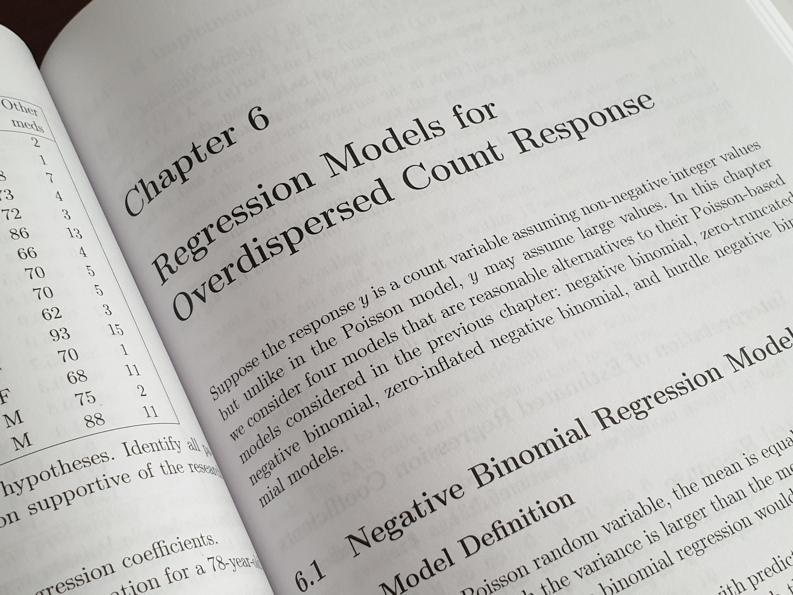
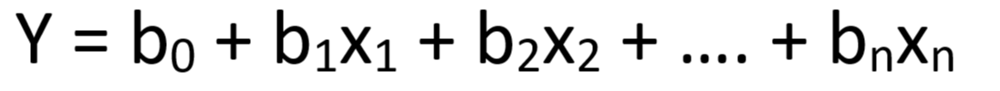
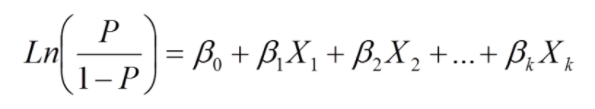
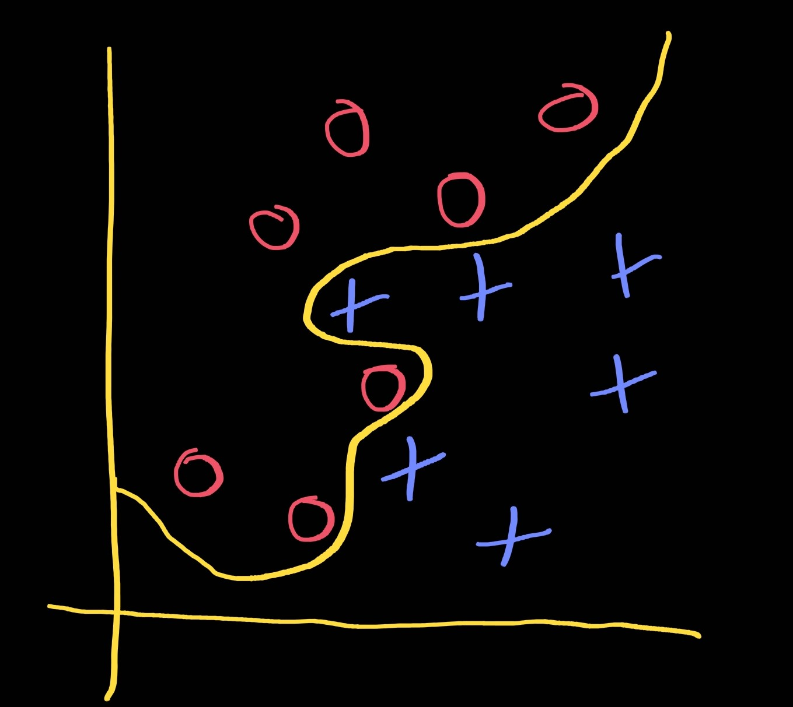

# Machine Learning in Medicine
### _A hands-on introductory course on machine learning techniques for physicians and healthcare professionals._

[](https://unsplash.com/photos/3RQnQyyzA9c)
  
# Part III - Linear/Logistic Regression

## Recap
In [Part II](part2.md) of this course, we went through the basic steps of data exploration. We started by surveying the distributions of a dataset by generating histograms using `DRESS.histograms`. Then we studied the central tendencies and dispersions of the various features in the dataset using `DRESS.means`, `DRESS.medians`, and `DRESS.frequencies`. We demonstrated the use of `DRESS.heatmap` and `DRESS.correlations` to visualize the degree of correlations among the various features in the dataset. Along the way, we also introduced the concept of missing value imputation.

It is important to stress that a proper data exploration process involves a great deal of dataset-specific analysis and is highly dependent on relevant domain knowledge. For instance, we would expect significantly higher variance in random blood glucose measurements compared to hemoglobin A1C based on the underlying biochemistry of these tests. Similarly, we would also expect a heavily skewed distribution when analyzing certain laboratory values, such as INR and creatinine, in the general population. We must take into account these dataset-specific characteristics when we are exploring a dataset.

## DRESS Kit Update
Before proceeding with the rest of this course, please take a moment to update the [DRESS Kit](https://github.com/waihongchung/dress) to release **1.2.0**. This version contains several important bug fixes, including a few to the linear/logistic regression algorithms.

## Mean/Mode Imputation
Remember that there are some missing values in our dataset? Let's start by imputing these missing values using the simplest algorithm of all: the mean/mode imputation. The rationale behind this algorithm stems from the [Law of Large Numbers](https://en.wikipedia.org/wiki/Law_of_large_numbers), which states that for a sufficiently large sample, the sample average converges towards the expected value. If the sample is large and the number of missing values is small, then it is reasonable to simply replace those missing values with the expected value since it is not going to adversely affect the results of most parametric statistical operations.

Once again, we create a boilerplate HTML file named `part3_1.htm` that loads the DRESS Kit as well as our custom JavaScript file `part3_1.js`.

```javascript
// Load the 'data.json' file stored on the local machine.
DRESS.local('data.json', processJSON);

function processJSON(subjects) {
    // Crete an array containing all 27 measures of chronic disease.
    const measures = ['ARTHRITIS', 'BPHIGH', 'CANCER', 'CASTHMA', 'CHD', 'COPD', 'DIABETES', 'HIGHCHOL', 'KIDNEY', 'MHLTH', 'PHLTH', 'STROKE', 'TEETHLOST',
        'ACCESS2', 'BPMED', 'CHECKUP', 'CHOLSCREEN', 'COLON_SCREEN', 'COREM', 'COREW', 'DENTAL', 'MAMMOUSE', 'PAPTEST', 'BINGE', 'CSMOKING', 'LPA', 'OBESITY', 'SLEEP'];

    DRESS.print(
        // Perform mean/mode imputation
        DRESS.meanMode(subjects, measures)
    )
}
```
The `DRESS.meanMode` function takes up to three parameters, the first one is an array of subjects, the second one is an array of numerical features, while the third one is an array of categorical features. Since all 27 measures of chronic disease in our dataset are numerical, we can ignore the third parameter. It is worth noting that the `DRESS.meanMode` function only considers `null` values as missing. Other erroneous or missing values in the dataset should be converted into `null` before they are processed by this function. It is also important to remember that the function fills in the missing values by altering the input subjects directly. 
```
ARTHRITIS   : 0 (0.00%) = 21.43
BPHIGH      : 0 (0.00%) = 30.65
CANCER      : 0 (0.00%) = 5.65
CASTHMA     : 0 (0.00%) = 9.74
CHD         : 0 (0.00%) = 5.60
COPD        : 0 (0.00%) = 6.31
DIABETES    : 0 (0.00%) = 10.81
HIGHCHOL    : 0 (0.00%) = 31.36
KIDNEY      : 0 (0.00%) = 3.10
MHLTH       : 0 (0.00%) = 13.92
PHLTH       : 0 (0.00%) = 12.88
STROKE      : 0 (0.00%) = 3.21
TEETHLOST   : 60    (0.22%) = 16.11
ACCESS2     : 1 (0.00%) = 16.99
BPMED       : 0 (0.00%) = 70.74
CHECKUP     : 0 (0.00%) = 69.01
CHOLSCREEN  : 0 (0.00%) = 78.74
COLON_SCREEN: 19    (0.07%) = 61.79
COREM       : 103   (0.38%) = 31.66
COREW       : 109   (0.40%) = 29.83
DENTAL      : 0 (0.00%) = 61.23
MAMMOUSE    : 37    (0.14%) = 79.19
PAPTEST     : 7 (0.03%) = 76.38
BINGE       : 0 (0.00%) = 18.07
CSMOKING    : 0 (0.00%) = 17.97
LPA         : 0 (0.00%) = 27.59
OBESITY     : 0 (0.00%) = 30.47
SLEEP       : 0 (0.00%) = 36.72
```
We can see from the printout the number of missing values in each feature as well as the values that were used as replacements. We are going to introduce some more sophisticated imputation algorithms later on during the course.

## Choosing a Modeling Technique
Most machine learning modeling techniques can be used to create either a regression model (where the output is a continuous numeric value, e.g. age, weight, height, laboratory values) or a classification model (where the output is one of several distinct values, e.g. gender, blood type, ethnicity) depending on how the model is setup. Most modeling techniques offer comparable performance when properly tuned. Nonetheless, these techniques are quite different from one another in terms of their strengths and limitations. When we are conducting an actual research study, we should choose a modeling technique that best fits our research question based on the unique properties of each technique.

Since we are restricted to using only one machine learning modeling technique for each part of this course, however, we must construct our research question to fit the specific properties of each technique.

## Regression Analysis vs Machine Learning
Some readers may wonder why we ever consider [linear/logistic regression](https://en.wikipedia.org/wiki/Regression_analysis) as a machine learning model. After all, most of us have been using these simple regression techniques in our research on a daily basis. Let's take a moment to discuss the conceptual differences between the typical use of these regression techniques and their use as a machine learning model. Linear/logistic regression is almost always used in biomedical journal articles as a tool to demonstrate an association between a predictor and an outcome. For example, in a study on non-alcoholic fatty liver disease (NAFLD), an author may want to show that body mass index (BMI) and hemoglobin A1C are independent predictors of NAFLD development. In order to do that, the author would collect a variety of clinical data, such as age, gender, medical comorbidities, and laboratory values, from patients with/without NAFLD. By using logistic regression, the author could show that the probability that a subject is diagnosed with NAFLD increases as his/her BMI or hemoglobin A1C increases. The author could also use the same model to show that there is no association between serum potassium level and the development of NAFLD. The author may take one step further by building a linear regression model to demonstrate a linear correlation between BMI and the NASH activity index. The key here is that we are using these regression techniques to prove the presence/absence of a *statistically significant* association between a predictor and an outcome.

When we are building a machine learning model using linear/logistic regression, however, our primary objective is to maximize the predictive performance of the model and we tend to pay less attention to the statistical significance of these associations. We are going to talk about how we can measure the predictive performance of a machine learning model, but for the time being, let's just assume that it is the same as the accuracy of a model. Let's remember that [statistical significance](https://en.wikipedia.org/wiki/Statistical_significance) is set, by convention, to an alpha of 0.05, which means we are only willing to accept a probability of a Type I error (false positive) of less than 5%. There is, however, nothing magical about this number 0.05. In fact, Ronald Fisher, the statistician who pioneered the concept of statistical hypothesis testing, recommended setting the alpha according to each specific use case. In other words, just because a predictor does not have a statistically significant association with an outcome does not mean it cannot improve the overall accuracy of our model. We also do not care too much about the strength of association between a particular predictor and the outcome. In fact, as we will see later in this course, we sometimes ignore certain predictors on purpose when we are building a machine learning model in order to minimize a problem called [overfitting](https://en.wikipedia.org/wiki/Overfitting). 

## Model Overview


Linear regression is typically used as a machine learning model to solve a regression problem (i.e. the outcome is a continuous numerical variable). More importantly, it is most appropriate in situations when it is reasonable to assume that there exists a linear correlation between the predictors and the outcome, at least for the range of values of interest. For example, let's say we are building a machine learning model to predict a patient's length-of-hospital-stay in order to optimize bed utilization. It is reasonable to suspect that patients who suffer from more medical comorbidities would stay longer. In contrast, a patient's temperature may not vary linearly with the length of stay as both hyperthermia and hypothermia may predict longer stay. In a typical machine learning with multiple predictors, different predictors may correlate with the outcome to different degrees and in opposite directions, thus enabling a sort of  'intelligence', but each predictor should correlate linearly with the outcome when the values of all other predictors are held constant.


Polynomial regression can be considered as a variation of linear regression. Instead of a linear correlation (i.e. a straight line) between a predictor and an outcome, the relationship follows a curve. Depending on the degree of the polynomial, the curve may have one or more [maxima or minima](https://en.wikipedia.org/wiki/Maxima_and_minima). To put it another way, linear regression is simply a special case of polynomial regression where the degree of the polynomial is set to 1. By mixing linear and polynomial regression in a machine learning model, it is possible to create even more complex 'intelligence'. A high degree of domain knowledge is needed to determine the appropriate degree of the polynomial.



Logistic Regression is typically used as a machine learning model to solve a classification problem, in particular, a binary classification problem (i.e. yes/no, true/false, positive/negative). Because the raw output from a logistic regression model refers to a probability (i.e. a continuous numerical value that ranges from 0 to 1), it is technically feasible to use logistic regression to solve a multi-class classification problem as well. For instance, if the final outcome belongs to one of four possible values (A, B, C, and D), we can create four [one-versus-rest](https://en.wikipedia.org/wiki/Multiclass_classification#One-vs.-rest) logistic regression models (i.e. A vs B/C/D, B vs A/C/D, C vs A/B/D, D vs A/B/C), apply the dataset on all four models, and pick the one that returns the highest probability value.

## Strengths and Limitations
One of the strengths of linear/logistic regression as a machine learning model is the fact that the technique is based on well-established mathematical algorithms. This means the algorithm is widely supported by most statistical analysis software packages. Moreover, the relationship between each predictor and the outcome is clearly defined by the constants in the regression formula, thus allowing us to determine the relative importance of each predictor easily. And because the resulting model is concisely represented by a simple mathematical formula, it can be deployed to the final application environment easily.



One of the limitations of linear/logistic regression as a machine learning model is the fact that the model can only support a smooth and continuous [decision boundary](https://en.wikipedia.org/wiki/Decision_boundary). Imagine if we are trying to build a machine learning model to classify a test subject into either red circles or blue crosses. It should be pretty obvious that it would be nearly impossible to represent the yellow line (i.e. the decision boundary) using a simple mathematical formula (whether it is beneficial to have such a complicated decision boundary is another story; hint: overfitting). In general, if we have a reasonable suspicion that the predictors vary linearly with the outcome, then linear/logistic regression can be a reasonable option. 

It is also important to note that linear/logistic regression can only accept numerical predictors because of the underlying mathematical operations. Although it is technically possible to convert categorical predictors into numerical values using [one-hot encoding](https://en.wikipedia.org/wiki/One-hot), this approach is not the most efficient and tends to over-represent those categorical predictors in the final model.

## Linear Regression
Let's start building our very first machine learning model. Recall that the 27 measures of chronic disease in the dataset can be categorized into unhealthy behaviors (5), health outcomes (13), and use of preventive services (9). For the sake of this exercise, let's pretend each data point represents one city/town. We want to build a model that allows us to predict the overall health outcomes of each city/town based on those unhealthy behaviors and the use of preventive services. 

The actual code needed to build our machine learning model is rather straightforward. We simply pass the dataset, the outcome of interest, and an array of predictors to the `DRESS.linear` function. 

```javascript
// Open the 'data.csv' file stored on the local machine.
DRESS.local('data.json', processJSON);

function processJSON(subjects) {
    // Health Outcomes
    const outcomes = ['ARTHRITIS', 'BPHIGH', 'CANCER', 'CASTHMA', 'CHD', 'COPD', 'DIABETES', 'HIGHCHOL', 'KIDNEY', 'MHLTH', 'PHLTH', 'STROKE', 'TEETHLOST'];
    // Use of Preventive Services
    const preventions = ['ACCESS2', 'BPMED', 'CHECKUP', 'CHOLSCREEN', 'COLON_SCREEN', 'COREM', 'COREW', 'DENTAL', 'MAMMOUSE', 'PAPTEST'];
    // Unhealthy Behaviors
    const behaviors = ['BINGE', 'CSMOKING', 'LPA', 'OBESITY', 'SLEEP'];

    // Perform mean/mode imputation of any missing values.
    DRESS.meanMode(subjects, [...outcomes, ...preventions, ...behaviors]);

    // Fit a model to predict "Physical health not good for >=14 days among adults aged >=18 Years"
    DRESS.print(
        DRESS.linear(subjects, 'PHLTH', [...preventions, ...behaviors])
    );

}
```

```
[PHLTH] R2: 0.92    aR2: 0.92   AIC: 7545.95    F: 20313.37 p: -0.00
(intercept) : +13.30    (95% CI 12.76 - 13.84)  t: +48.21   p: 0.00
ACCESS2     :  0.00 (95% CI -0.01 - 0.00)   t: -1.18    p: 0.24
BPMED       : +0.08 (95% CI 0.07 - 0.08)    t: +35.55   p: 0.00
CHECKUP     : -0.04 (95% CI -0.04 - -0.03)  t: -13.44   p: 0.00
CHOLSCREEN  : +0.06 (95% CI 0.06 - 0.07)    t: +24.56   p: 0.00
COLON_SCREEN: +0.05 (95% CI 0.05 - 0.06)    t: +20.28   p: 0.00
COREM       : -0.04 (95% CI -0.05 - -0.04)  t: -22.08   p: 0.00
COREW       : -0.06 (95% CI -0.06 - -0.05)  t: -23.98   p: 0.00
DENTAL      : -0.12 (95% CI -0.12 - -0.11)  t: -57.71   p: 0.00
MAMMOUSE    : -0.01 (95% CI -0.02 - -0.00)  t: -2.85    p: 0.00
PAPTEST     :  0.00 (95% CI -0.00 - 0.00)   t: -1.37    p: 0.17
BINGE       : -0.20 (95% CI -0.20 - -0.19)  t: -69.55   p: 0.00
CSMOKING    : +0.29 (95% CI 0.29 - 0.30)    t: +78.25   p: 0.00
LPA         : +0.07 (95% CI 0.06 - 0.07)    t: +18.34   p: 0.00
OBESITY     : -0.02 (95% CI -0.02 - -0.01)  t: -7.75    p: 0.00
SLEEP       : -0.09 (95% CI -0.09 - -0.08)  t: -32.70   p: 0.00
```

One of the first things to notice from the output is that the model has a [coefficient of determination](https://en.wikipedia.org/wiki/Coefficient_of_determination) (not to be confused with the [coefficient of correlation](https://en.wikipedia.org/wiki/Correlation_coefficient)) of 0.92, which is rather impressive considering we have not made any sort of optimization to the model. We can also see that all predictors, except for `PAPTEST` and `ACCESS2`, were found to have a statistically significant correlation with the outcome. This is most likely due to the fact that the number of data points in the dataset is huge. A question that we need to ask ourselves is whether the inclusion of all of these predictors is actually improving the predictive power of the model. One way to assess the relative quality of a statistical model is by using a measure called [Akaike Information Criterion](https://en.wikipedia.org/wiki/Akaike_information_criterion) (AIC), which is, in essence, a balanced measure of both the goodness of fit of a model and the simplicity of a model. Basically, we will need to build a bunch of models using various permutations of the predictors, calculate the AIC of each model, and find the model with the lowest AIC. Of course, doing this by hand can be quite tedious, so we will rely on a built-in function in the DRESS KIT called `DRESS.forward`, which is a [stepwise feature selection](https://en.wikipedia.org/wiki/Stepwise_regression) algorithm that uses the AIC as the selection criterion. 

```javascript
// Perform forward selection on an array of features using DRESS.linear as the regression algorithm.
DRESS.print(
    DRESS.forward(DRESS.linear, subjects, 'PHLTH', [...preventions, ...behaviors])
)
```

It may take up to 30 seconds to complete the function since it needs to build multiple models from the full dataset. It confirms our suspicion that the `PAPTEST` and `ACCESS2` predictors do not add to the predictive power of the model and should be left out of the final model. It is important to note that this is just one of many different ways to assess the quality of our model. We may arrive at a different result if we use a different quality measure, such as [adjusted R2](https://en.wikipedia.org/wiki/Coefficient_of_determination#Adjusted_R2) or [Bayesian Information Criterion](https://en.wikipedia.org/wiki/Bayesian_information_criterion). It is also important to note that this algorithm of stepwise feature selection essentially uses the entire dataset for both *training* and *validation* and is prone to [overfitting](https://en.wikipedia.org/wiki/Overfitting). We will introduce other techniques for validating a model's performance in subsequent parts of the course.

Now that we have built a model a machine learning module, let's actually try to use it to make some predictions. Again, the concept here is that we are public health experts and we want to be able to predict the overall health outcomes of a city/town based on those unhealthy behaviors and the use of preventive services.

```javascript
// Create a linear regression model based on all predictors except ACCESS2 and PAPTEST.
const model = DRESS.linear(subjects, 'PHLTH', ['BPMED', 'CHECKUP', 'CHOLSCREEN', 'COLON_SCREEN', 'COREM', 'COREW', 'DENTAL', 'MAMMOUSE', 'BINGE', 'CSMOKING', 'LPA', 'OBESITY', 'SLEEP']);

// Create a hypothetical city with the following parameters
const city = {
        BPMED: 50,
        CHECKUP: 50,
        CHOLSCREEN: 75,
        COLON_SCREEN: 65,
        COREM: 30,
        COREW: 30,
        DENTAL: 60,
        MAMMOUSE: 70,
        BINGE: 10,
        CSMOKING: 10,
        LPA: 30,
        OBESITY: 30,
        SLEEP: 30        
    };

// Use the model to make a prediction
DRESS.print(
        model.predict(city) // Expect: 12.236334776054186
);
```

Our model predicts that about 12.24% of adults in this hypothetical city/town have suffered from poor physical health for >=14 days in the past year.

## Logistic Regression
Let's move on to logistic regression. As mentioned above, this machine learning technique is classically used for solving binary classification problems. We need to come up with a research question that can be answered with a binary response. Suppose we want to identify cities/towns that have a higher than average prevalence of diabetes in order to prioritize resource allocation, we can build a logistic regression model to achieve this.

First, we need to convert the numerical health outcome `DIABETES` into a binary value (1 for those with higher than average prevalence of diabetes, 0 for otherwise). We can refer back to Part 2 of the course to obtain the average prevalence of diabetes in this dataset. We will label the new binary outcome as `DM`. Similar to the way we build our linear regression model, we can create a logistic regression model by passing the dataset, the outcome of interest, and an array of predictors to the `DRESS.logistic` function.  

```javascript
// Open the 'data.csv' file stored on the local machine.
DRESS.local('data.json', processJSON);

function processJSON(subjects) {
    // Health Outcomes
    const outcomes = ['ARTHRITIS', 'BPHIGH', 'CANCER', 'CASTHMA', 'CHD', 'COPD', 'DIABETES', 'HIGHCHOL', 'KIDNEY', 'MHLTH', 'PHLTH', 'STROKE', 'TEETHLOST'];
    // Use of Preventive Services
    const preventions = ['ACCESS2', 'BPMED', 'CHECKUP', 'CHOLSCREEN', 'COLON_SCREEN', 'COREM', 'COREW', 'DENTAL', 'MAMMOUSE', 'PAPTEST'];
    // Unhealthy Behaviors
    const behaviors = ['BINGE', 'CSMOKING', 'LPA', 'OBESITY', 'SLEEP'];

    // Perform mean/mode imputation of any missing values.
    DRESS.meanMode(subjects, [...outcomes, ...preventions, ...behaviors]);

    // Convert the numerical value into a boolean value.
    subjects.map(subject => {
        subject['DM'] = (subject['DIABETES'] > 10.8) ? 1 : 0
    });

    // Fit a model to predict higher than average prevalence of diabetes
    DRESS.print(
        DRESS.logistic(subjects, ['DM'], [...preventions, ...behaviors])
    );

}
```

```
[DM]    R2: 0.78    AIC: 8221.85    deviance: 28776.42  p: 0.00
(intercept) : -29.38    OR: 0.00    (95% CI 0.00 - 0.00)    z: -20.89   p: 0.00
ACCESS2     : +0.06 OR: 1.07    (95% CI 1.05 - 1.09)    z: +6.61    p: 0.00
BPMED       : +0.54 OR: 1.72    (95% CI 1.66 - 1.77)    z: +35.34   p: 0.00
CHECKUP     : -0.16 OR: 0.85    (95% CI 0.83 - 0.88)    z: -11.41   p: 0.00
CHOLSCREEN  : +0.14 OR: 1.15    (95% CI 1.12 - 1.18)    z: +10.87   p: 0.00
COLON_SCREEN: +0.02 OR: 1.02    (95% CI 1.00 - 1.05)    z: +2.23    p: 0.03
COREM       : -0.11 OR: 0.89    (95% CI 0.88 - 0.91)    z: -13.49   p: 0.00
COREW       : -0.08 OR: 0.92    (95% CI 0.90 - 0.94)    z: -8.36    p: 0.00
DENTAL      : -0.22 OR: 0.80    (95% CI 0.79 - 0.82)    z: -24.09   p: 0.00
MAMMOUSE    : +0.01 OR: 1.01    (95% CI 0.98 - 1.04)    z: +0.57    p: 0.57
PAPTEST     : +0.02 OR: 1.02    (95% CI 1.02 - 1.02)    z: +14.94   p: 0.00
BINGE       : -0.34 OR: 0.71    (95% CI 0.69 - 0.73)    z: -23.05   p: 0.00
CSMOKING    : -0.20 OR: 0.82    (95% CI 0.79 - 0.84)    z: -12.60   p: 0.00
LPA         : +0.07 OR: 1.07    (95% CI 1.04 - 1.10)    z: +4.36    p: 0.00
OBESITY     : +0.16 OR: 1.17    (95% CI 1.15 - 1.19)    z: +17.66   p: 0.00
SLEEP       : +0.22 OR: 1.24    (95% CI 1.22 - 1.27)    z: +19.09   p: 0.00
```

We can see the raw unoptimized model has a coefficient of determination 0f 0.78, which is fairly reasonable. We can further optimize our choice of predictors using the `DRESS.forward` function, although in this particular case, doing so does not seem to improve the goodness of fit significantly. Just like the case of logistic regression, we can use the model to make predictions by passing a hypothetical city/town as a parameter. 

```javascript
// Fit a model to predict higher than average prevalence of diabetes
const model = DRESS.logistic(subjects, ['DM'], [...preventions, ...behaviors]);

// Create a hypothetical city with the following parameters
const city = {
    ACCESS2: 30,
    BPMED: 50,
    CHECKUP: 50,
    CHOLSCREEN: 75,
    COLON_SCREEN: 65,
    COREM: 30,
    COREW: 30,
    DENTAL: 60,    
    MAMMOUSE: 70,
    PAPTEST: 80,
    BINGE: 10,
    CSMOKING: 10,
    LPA: 30,
    OBESITY: 30,
    SLEEP: 30
};

// Use the model to make a prediction
DRESS.print(
    model.predict(city) // Expect: 0.003722780278794715
);
```

Although logistic regression is typically used to solve a binary classification problem, the result of the `predict` function is not a binary value, but a continuous numerical value that represents the probability of outcome occurrence. In order to convert the numerical value, which ranges from 0 to 1, into a binary value (i.e. whether the city/town has a higher than average prevalence of diabetes), we need to determine a suitable cut-off value, either by setting it empirically to 0.5 or by using a test statistic to help maximize the performance of the classification function. One such test statistic is the [Youden Index](https://en.wikipedia.org/wiki/Youden%27s_J_statistic), which represents a tradeoff between sensitivity and specificity. Using the `roc` function of the model, we can compute the [Receiver Operating Characteristic Curve](https://en.wikipedia.org/wiki/Receiver_operating_characteristic) as well as the Youden Index automatically.

```javascript
// Generate a ROC curve using the original dataset
DRESS.print(
    model.roc(subjects)     
)
// Expect: logistic: 0.99   (95% CI 0.98 - 0.99)    z: +611.68  p: 0.00 cutoff: 0.44    tpr: 0.93   tnr: 0.94
```

The `roc` function takes an array of subjects, which can either be the original dataset or another validation dataset, as a parameter. The result shows an [Area Under the Curve (AUC)](https://en.wikipedia.org/wiki/Receiver_operating_characteristic#Area_under_the_curve) or Concordance Statistic (C statistic) of 0.99, which suggests the model is able to distinguish between the positive and negative outcome with near-perfect accuracy. The result also shows that the optimal cutoff is 0.44.  

## Wrap Up
Let's review what we have learned in Part III. We introduced one method of missing value imputation called mean/mode imputation (using `DRESS.meanMode`). We discussed the concept of decision boundary as well as the important conceptual differences between using linear/logistic regression for regression analysis and using it for machine learning. We went through the actual process of building a linear/logistic regression machine learning model (using `DRESS.linear` and `DRESS.logistic`) as well as using the model to make predictions (using `model.predict`). Along the way, we touched upon a feature selection technique called forward selection (`DRESS.forward`) and a test statistic, called Youden Index, for identifying an optimal cut-off value for logistic regression models.

## Model Summary
*Linear/Logistic Regression*
- Strengths    
    - Easy to implement (supported by most statistical analysis software)
    - Easy to optimize (just need to pick the appropriate predictors)
    - Easy to interpret (relationships between predictors and outcome are clearly defined)
    - Easy to deploy (model can be represented by a simple mathematical formula)
- Limitations
    - Smooth, continuous decision boundary
    - Only works with numerical predictors

## Exercise
As an exercise, let's try to build a model to predict the prevalence of cancer in a hypothetical town/city as well as a model to identify cities/towns with <50% colon cancer screening rates based on the health outcomes. Pay attention to selecting the appropriate modeling technique as well as the relevant predictors based on the research question.