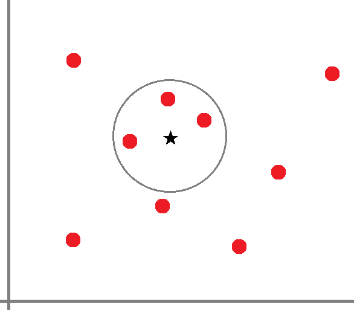
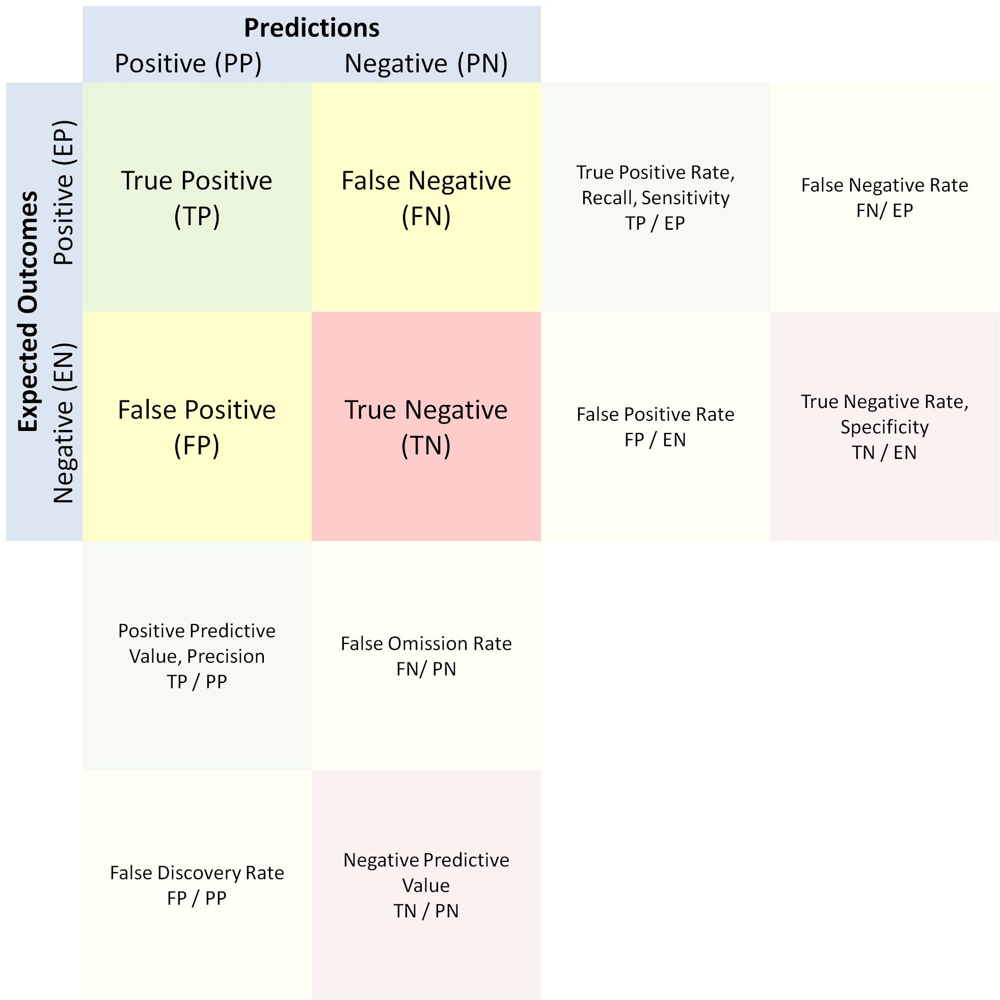
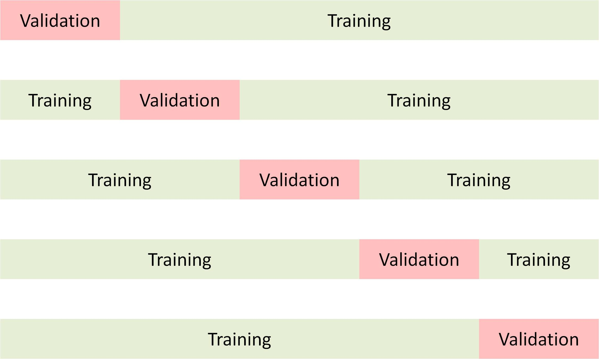
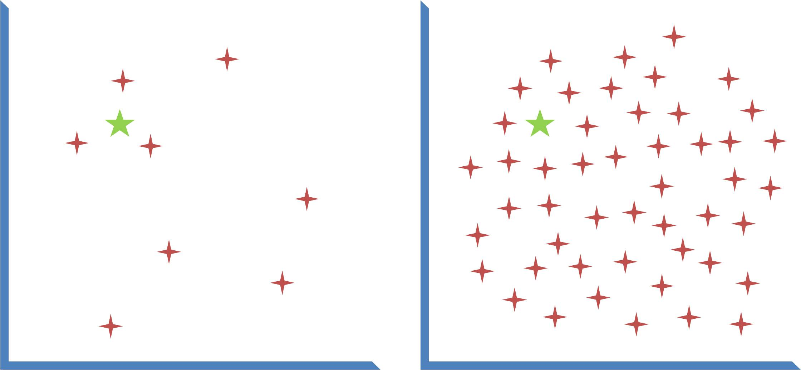

# Machine Learning in Medicine
### _A hands-on introductory course on machine learning techniques for physicians and healthcare professionals._

[](https://unsplash.com/photos/pJk4RRS7urs)
  
# Part IV - K-Nearest Neighbors

## Recap
In [Part III](part3.md) of this course, we explored our first machine learning model - linear/logistic regression. We discussed the conceptual differences using linear/logistic regression for regression analysis and using it for machine learning. We went through the strengths and limitations of the technique and we demonstrated the steps to building a model using the DRESS Kit as well as making predictions using the model. 

It is important to highlight that despite all the buzz around some of the more advanced machine learning techniques, such as random forest and neural network, linear/logistic regression remains a highly useful machine learning technique in clinical research thanks to its simplicity. Many risk scoring systems, such as Framingham Risk Score and MELD-Na Score, are functionally identical to a linear/logistic regression-based machine learning model, even though these scoring systems may not have been derived entirely by an algorithm. 

## DRESS Kit Update
Before proceeding with the rest of this course, please take a moment to update the [DRESS Kit](https://github.com/waihongchung/dress) to release **1.2.5**. This version contains a feature update to the kNN algorithm that we will be using here.

## Model Overview
K-nearest neighbors (kNN) works on the assumption that similar subjects behave similarly. Unlike most other machine learning techniques, kNN models do not attempt to 'learn' the relationship between the predictors and the outcome. In fact, a kNN model is typically built without much of a training phase other than storing the entire training dataset in a memory-efficient format for later retrieval. When it is time to make a prediction, the model determines the degree of similarity between the test subject and every subject in the training dataset, picks the top `k` training subjects (neighbors) based on the degree of similarity, and returns the outcome of interest by computing the mode (for a classification problem) or the mean (for a regression problem) of those `k` subjects. As a result, the decision boundary of kNN is not a smooth line, but a circle with a radius of `k`. 



There are three hyperparameters to consider when we need to implement a kNN model, the predictors to be included in the model, the metric used for measuring the degree of similarity (e.g. [Manhattan Distance](https://en.wikipedia.org/w/index.php?title=Manhattan_distance), [Euclidean Distance](https://en.wikipedia.org/wiki/Euclidean_distance), or [Minkowski Distance](https://en.wikipedia.org/wiki/Minkowski_distance)), and the value of `k`.

## Strengths and Limitations
One of the strengths of the kNN technique is its simplicity; there are no convoluted mathematical operations involved. The algorithm simply finds subjects within the training dataset that are most similar to the test subject. The algorithm can work on both numerical and categorical predictors (as long as the implementation supports computing distance metrics from categorical values). Most impressively, the same model can be used to make predictions on multiple outcomes as long as they share the same predictors. This unique property allows kNN models to be used not only to solve classification or regression problems but also for cohort matching and missing value imputation.

One of the major limitations of the kNN technique is computational inefficiency when making a prediction. Every time we use the model to make a prediction, the algorithm needs to compute the distance metric for every subject in the training dataset and to sort the entire training dataset based on the distance metric. It is also rather cumbersome to deploy the model in a production environment because the entire training dataset must be reproduced. 

The kNN technique also suffers from several performance limitations. Because the predicted outcome is the average value of that of the top `k` neighbors, it will never go beyond the range of values observed in the training dataset. Consider, for instance, a kNN mode with just one predictor (height) and one outcome (weight). If the tallest training subject is 6 feet tall and weighs 200lbs, then this training subject will be the closet neighbor to any test subject that is 6 feet or taller and thus the predicted outcome would be around 200lbs. Furthermore, kNN model is prone to outliers because the algorithm considers the entire training dataset during the prediction phase and each training subject has the same probability of being considered a neighbor. 

## Implementation
Let's start building a kNN model. Similar to how we construct a linear/logistic regression model, we will consider the use of preventive services and unhealthy behaviors as predictors in order to build a machine learning model that will help us predict the health outcomes of a hypothetical city/town. 

```javascript
// Open the 'data.csv' file stored on the local machine.
DRESS.local('data.json', processJSON);

function processJSON(subjects) {
    // Use of Preventive Services
    const preventions = ['ACCESS2', 'BPMED', 'CHECKUP', 'CHOLSCREEN', 'COLON_SCREEN', 'COREM', 'COREW', 'DENTAL', 'MAMMOUSE', 'PAPTEST'];
    // Unhealthy Behaviors
    const behaviors = ['BINGE', 'CSMOKING', 'LPA', 'OBESITY', 'SLEEP'];

    // Create a kNN model based on the use of preventive services and unhealthy behaviors
    const model = DRESS.kNN(subjects, [...preventions, ...behaviors])
    // 
    DRESS.print(
        model
    );

}
```

The `kNN` function accepts up to four parameters. The first one is an array of training subjects. The second one is an array of numerical features to be used as predictors. The third one, if specified, is an array of categorical features to be used as predictors. The last one specifies whether the predictors should be normalized or not prior to making a prediction. By default, the predictors are normalized, which means the maximum distance for each predictor is 1 and every predictor contributes equally to the distance metric. 

One of the first things to notice is that we do not have to specify the outcome of interest when we are building the kNN model. And the printout does not contain any numerical or statistical information, other than the names of the predictors used to build the model. This is because the algorithm does not really do much at this stage except for extracting and storing the values of the predictors in memory. 

To make a prediction using the kNN model, we need to provide a test subject and to specify the outcome, whether it is a classification or regression problem, and, optionally, the value of `k`.

```javascript
// Create a hypothetical city
const city = {
    ACCESS2: 40,
    BPMED: 50,
    CHECKUP: 50,
    CHOLSCREEN: 75,
    COLON_SCREEN: 65,
    COREM: 30,
    COREW: 30,
    DENTAL: 60,
    MAMMOUSE: 70,
    PAPTEST: 85,
    BINGE: 10,
    CSMOKING: 10,
    LPA: 30,
    OBESITY: 30,
    SLEEP: 30        
}

// Make multiple predictions
DRESS.print(      
    model.predict(city, 'PHLTH', false), // Expected: 11.908780244054885    
    model.predict(city, 'DIABETES', false), // Expected: 8.398841146454087
    model.predict(city, 'state', true) // Expected: Utah
);
```

We can see one of the advantages of a kNN model is the ability to make predictions on different outcomes of interest using the same model (as long as we believe that the same predictors should be used). We can also see that it is very easy to solve classification problems using a kNN model. There is no need to do any [one-hot encoding](https://en.wikipedia.org/wiki/One-hot).

## Model Performance
### Performance Metrics
Building a functional kNN model using the DRESS Kit is not difficult at all, but we should ask ourselves if we can create an even better model if we optimize some of the parameters (or more precisely *hyper*parameters) associated with the model. These hyperparameters include the value of `k`, feature selection, and feature scaling. Before we talk about the optimization process, however, we must first define how we are going to measure the performance of a model. If we are given two models, how do we decide which one is 'better'?

The basic idea of assessing the performance of a model is quantifying the differences between the expected outcomes and the predictions. Intuitively, we can appreciate that if the predictions are exactly the same as the expected outcomes, the model is considered perfect. If the predictions are random values centered around the average expected outcomes, then the model is considered useless. The key is to find a suitable statistical measure to quantify such differences.

For regression problems, the most commonly used statistical measures are [coefficient of determination](https://en.wikipedia.org/wiki/Coefficient_of_determination) (R2), [mean absolute error](https://en.wikipedia.org/wiki/Mean_absolute_error) (MAE), or [root mean square error](https://en.wikipedia.org/wiki/Root-mean-square_deviation) (RMSE). Both MAE and RMSE represent the average differences between the expected outcomes and the predictions, but RMSE penalizes large errors more than small errors (because of the squaring), while MAE does not take the magnitude of each error into consideration. R2 is a unit-free measurement that ranges from negative infinity to 1 (perfect). It represents how well the expected outcomes match with the predictions (technically it measures the proportion of variance in the expected outcomes that is explained by the predictions). This is not to be confused with the [coefficient of correlation](https://en.wikipedia.org/wiki/Correlation_coefficient) (R), which only represents how well two variables follow one another (when the values of one variable go up, the other variable goes up as well, or vice versa).

For classification problems, the most commonly used statistical measures are [accuracy](https://en.wikipedia.org/wiki/Accuracy_and_precision) (the proportion of subjects that were correctly classified), [precision](https://en.wikipedia.org/wiki/Accuracy_and_precision) (the proportion of correctly classified subjects amongst all subjects that were predicted to be of a certain class, also known as **positive predictive value**), [recall](https://en.wikipedia.org/wiki/Precision_and_recall#Recall) (the proportion of subjects of a certain class that is correctly classified to that class, also known as **true positive rate**), and [F score](https://en.wikipedia.org/wiki/F-score) (a harmonic mean of precision and recall).



### Cross Validation
Every machine learning model generated by the DRESS Kit contains a `performance` function that can be used to generate the appropriate performance measures. We will start by demonstrating a straightforward, but unfortunately incorrect, way to use this function.

```javascript
// Incorrect way to calculate performance.
DRESS.print(
    model.performance(subjects, 'PHLTH', false)
)
```
It is going to take a few minutes to compute the performance measure (the script may timeout before it completes) because the algorithm has to make predictions on all 28,000 subjects and compute the coefficient of determination based on all those data points. We may be pleasantly surprised by the fact that the value of R2 is 0.98 (which is near perfect) until we realize our mistake. Remember that the kNN algorithm works by finding subjects from the training dataset that are similar to the test subject. If we use the test subjects that come from the same training dataset, then the algorithm is bound to find the subject from the training dataset that is *identical* to the test subject. As a result, it would create an illusion that the model is performing very well. 

The correct way to compute the performance measure of a model is to use a validation dataset that does NOT overlap with the training dataset. There are three ways to create such a validation dataset. In a well-designed research study, the investigator may enroll additional subjects from an external site (in order to claim that the model is externally validated). Another way is to reserve a portion (usually 20%) of the original dataset as the validation dataset and only use the remaining 80% as the training dataset. The drawback of this approach is that the size of the training dataset is reduced. The most popular way is to conduct something called [k-fold cross validation](https://en.wikipedia.org/wiki/Cross-validation_(statistics)#k-fold_cross-validation). The idea is that we divide the original dataset into `k` parts, and use the first part for validation and the rest for training. Then we repeat the procedure again by using the second part for validation and the rest for training. The process is repeated until every part is used for validation once and training for `k-1` times. Eventually, we report the performance measure by taking an average.



```javascript
// Open the 'data.csv' file stored on the local machine.
DRESS.local('data.json', processJSON);

function processJSON(subjects) {
    // Use of Preventive Services
    const preventions = ['ACCESS2', 'BPMED', 'CHECKUP', 'CHOLSCREEN', 'COLON_SCREEN', 'COREM', 'COREW', 'DENTAL', 'MAMMOUSE', 'PAPTEST'];
    // Unhealthy Behaviors
    const behaviors = ['BINGE', 'CSMOKING', 'LPA', 'OBESITY', 'SLEEP'];

    // Parameters to be used to create a kNN model
    const training_parameters = [[...preventions, ...behaviors]];

    // Parameters to be used for validation
    const validation_parameters = ['PHLTH', false];

    // Perform cross validation
    DRESS.print(
        DRESS.crossValidate(DRESS.kNN, subjects, training_parameters, validation_parameters)
    );

}
```

To perform cross-validation using the `DRESS.crossValidate` function from the DRESS Kit, we need to specify the machine learning model, the dataset, and the hyperparameters needed to create and validate the model. The code is slightly complicated because we need to pass those hyperparameters as two separate arrays. Optionally, we can call the function asynchronously using `DRESS.async` to prevent the script from timing out.

```javascript
DRESS.print(
    DRESS.async('DRESS.crossValidate', { async: 'DRESS.kNN' }, subjects, training_parameters, validation_parameters)
);
```

## Optimization
### Value of K
The first optimization that most people think of, yet probably the least important, is the value of `k`. Intuitively, we can appreciate that if `k` is too large (e.g. the size of the entire training dataset), then the model will not be very accurate because it is going to make similar predictions no better what (i.e. underfitting). If `k` is too small (e.g. 1), then the model will also not be very accurate when applied to a validation dataset because it is prone to noises in the training dataset (i.e. overfitting). The optimal value of `k` is highly dependent on the amount of noise (or random variations in the outcome values) in the training dataset.


The only way to determine the optimal value of `k` is to perform cross-validation on a range of values. That said, in a large dataset such as the one we are working on, the training dataset is usually distributed nearly evenly across the sample space that small changes in the value of `k` do not affect the predictions significantly. Consider the figure below, for example, in which the red stars represent the training subjects and the green star represents the test subject. We can see that the difference between a `k` of 3 and a `k` of 4 is far greater for the dataset on the left compared to the dataset on the right. Furthermore, the kNN algorithm used by the DRESS Kit is actually a weighted-kNN algorithm, which means it takes into account the distance metrics between the training subjects and the test subject and reduces the influences of highly dissimilar subjects even if they were included.



### Feature Selection
A far more important optimization for the kNN machine learning technique is feature selection, i.e. the predictors that are used to build the model. Intuitively, we can appreciate that if a predictor has no relationship with the outcome (e.g. last 4 digits of SSN and BMI), then the performance of the model is likely to be adversely affected by the inclusion of such a predictor. Unlike some of the other machine learning techniques that can automatically minimize the influence of insignificant predictors, every predictor included in the kNN model contributes to the distance metric. Selecting the optimal set of features requires a great deal of domain knowledge, but we can also verify our selections using cross-validation.

To demonstrate the importance of proper feature selection, we will introduce two predictors filled with random values to see how they affect the performance of the model.

```javascript
// Open the 'data.csv' file stored on the local machine.
DRESS.local('data.json', processJSON);

function processJSON(subjects) {
    // Use of Preventive Services
    const preventions = ['ACCESS2', 'BPMED', 'CHECKUP', 'CHOLSCREEN', 'COLON_SCREEN', 'COREM', 'COREW', 'DENTAL', 'MAMMOUSE', 'PAPTEST'];
    // Unhealthy Behaviors
    const behaviors = ['BINGE', 'CSMOKING', 'LPA', 'OBESITY', 'SLEEP'];

    // Add two predictors derived from random values
    subjects.map(subject => {
        subject['RANDOM'] = Math.random();
        subject['RANDOM2'] = Math.random();
    });

    // Parameters to be used to create a kNN model
    const predictors = [...preventions, ...behaviors, 'RANDOM', 'RANDOM2'];

    // Parameters to be used for validation
    const validation_parameters = ['PHLTH', false];

    let i = 3;
    while (i--) {
        DRESS.print(
            // Print out the predictors
            predictors.join(),
            // Perform cross validation
            DRESS.async('DRESS.crossValidate', { async: 'DRESS.kNN' }, subjects, [predictors], validation_parameters)
        );
        // Remove the last predictors
        predictors.pop();
    }
}
```

We can see that the inclusion of the two randomly generated predictors actually decreases the overall performance and slows down the model.

### Feature Scaling
An equally important optimization for the kNN machine learning technique is feature scaling. By default, the kNN algorithm normalizes all the predictors prior to building a model. This is done so that features that have wider ranges (e.g. platelet count, whose values can range from <50 to >250) would have the same effect on the distance metric as features with much narrower ranges (e.g. creatinine, whose values typically fall between ~1 to <10). Intuitively, we can imagine if we are going to build a kNN model to predict the number of colonic polyps in patients undergoing screening colonoscopy, a family history of polyposis syndrome would be a stronger predictor than a family history of depression. We can set the 'strength' of each predictor by scaling it up or down. Unfortunately, there is no way to determine the optimal scales algorithmically. A great deal of domain knowledge and trial-and-error is needed.

## Imputation
One of the most common applications of the kNN algorithm is missing value imputation. We have previously introduced a simple imputation technique by replacing missing values with the means or modes. While mean/mode imputation works reasonably well in a large dataset with very few missing values, every missing value is replaced by the same replacement value. kNN imputation is essentially a more advanced version of mean/mode imputation, instead of using the mean/mode of the entire dataset, it uses the mean/mode of those subjects that are similar to the subject with a missing value as a replacement.

To implement the kNN imputation algorithm, we simply need to divide the subjects into those without missing values and those with missing values. Next, we use the former to build a kNN model and find the top `k` neighbors to each of the subjects in the latter. Finally, we apply the mean/mode imputation technique to the missing values based on those `k` neighbors. 

```javascript
// Open the 'data.csv' file stored on the local machine.
DRESS.local('data.json', processJSON);

function processJSON(subjects) {
    // Use of Preventive Services
    const preventions = ['ACCESS2', 'BPMED', 'CHECKUP', 'CHOLSCREEN', 'COLON_SCREEN', 'COREM', 'COREW', 'DENTAL', 'MAMMOUSE', 'PAPTEST'];
    // Unhealthy Behaviors
    const behaviors = ['BINGE', 'CSMOKING', 'LPA', 'OBESITY', 'SLEEP'];

    // Parameters to be used to create a kNN model
    const predictors = [...preventions, ...behaviors];

    // Create a kNN model
    const model = DRESS.kNN(subjects, predictors);

    // Impute missing values
    DRESS.print(
        model.impute(subjects, predictors)
    );
}
```

```
ACCESS2     : 1 (0.00%)
BPMED       : 0 (0.00%)
CHECKUP     : 0 (0.00%)
CHOLSCREEN  : 0 (0.00%)
COLON_SCREEN: 19    (0.07%)
COREM       : 103   (0.38%)
COREW       : 109   (0.40%)
DENTAL      : 0 (0.00%)
MAMMOUSE    : 37    (0.14%)
PAPTEST     : 7 (0.03%)
BINGE       : 0 (0.00%)
CSMOKING    : 0 (0.00%)
LPA         : 0 (0.00%)
OBESITY     : 0 (0.00%)
SLEEP       : 0 (0.00%)
```

The imputation algorithm is smart enough to identify those subjects with missing (null) values and to compute the appropriate replacement values based on those subjects without missing values.

## Cohort Matching
Another common application of the kNN algorithm is cohort matching. It is necessary, in most retrospective studies, to identity a control group (a group of subjects that do not have the outcome or exposure of interest) in order to compute the associated risk ratios or odds ratios. Ideally, the experimental group and the control group should be nearly identical in every aspect, except for the outcome or exposure of interest. Because the kNN algorithm is designed to identity subjects based on similarity, it is well-suited for this purpose.

```javascript
// Open the 'data.csv' file stored on the local machine.
DRESS.local('data.json', processJSON);

function processJSON(subjects) {
    // Use of Preventive Services
    const preventions = ['ACCESS2', 'BPMED', 'CHECKUP', 'CHOLSCREEN', 'COLON_SCREEN', 'COREM', 'COREW', 'DENTAL', 'MAMMOUSE', 'PAPTEST'];

    // Create two arrays. One for the cases and one for the non-cases.
    const cases = [];
    const noncases = [];

    // Assign subjects with >30% PHLTH outcome as cases or otherwise as non-cases.
    subjects.map(subject => {
        if (subject['PHLTH'] > 25) {
            cases.push(subject);
        } else {
            noncases.push(subject);
        }
    });

    // Construct a kNN model using the non-cases.
    const model = DRESS.kNN(noncases, preventions);

    // Create a control group by matching the non-cases to the cases.
    const controls = model.match(cases);

    // Assess the quality of the match.
    DRESS.print(
        DRESS.means(cases, preventions, controls)
    );

}
```

```
ACCESS2     : [93]  27.08   (95% CI 25.33 - 28.84)  SD: 8.64    SKW: 1.55   KUR: 2.82   vs [93] 26.82   (95% CI 25.03 - 28.62)  SD: 8.81    SKW: 1.31   KUR: 1.60   z: +0.20    p: 0.84
BPMED       : [93]  80.90   (95% CI 79.98 - 81.82)  SD: 4.53    SKW: -0.15  KUR: 0.64   vs [93] 78.79   (95% CI 78.00 - 79.59)  SD: 3.93    SKW: -0.28  KUR: -0.27  z: +3.38    p: 0.00
CHECKUP     : [93]  76.15   (95% CI 74.93 - 77.36)  SD: 5.98    SKW: -0.77  KUR: -0.21  vs [93] 75.72   (95% CI 74.58 - 76.85)  SD: 5.59    SKW: -1.07  KUR: 0.23   z: +0.51    p: 0.61
CHOLSCREEN  : [93]  76.13   (95% CI 75.01 - 77.25)  SD: 5.50    SKW: -0.27  KUR: 0.18   vs [93] 75.85   (95% CI 74.86 - 76.85)  SD: 4.89    SKW: -0.61  KUR: 0.32   z: +0.37    p: 0.71
COLON_SCREEN: [93]  46.24   (95% CI 44.92 - 47.57)  SD: 6.51    SKW: -0.18  KUR: -0.40  vs [93] 47.24   (95% CI 46.05 - 48.42)  SD: 5.84    SKW: -0.03  KUR: 0.02   z: -1.10    p: 0.27
COREM       : [93]  18.36   (95% CI 17.40 - 19.31)  SD: 4.69    SKW: 0.31   KUR: 2.34   vs [93] 18.80   (95% CI 17.89 - 19.71)  SD: 4.49    SKW: 0.14   KUR: 2.93   z: -0.66    p: 0.51
COREW       : [93]  17.26   (95% CI 16.38 - 18.14)  SD: 4.32    SKW: 0.90   KUR: 7.91   vs [93] 17.56   (95% CI 16.84 - 18.29)  SD: 3.57    SKW: -0.11  KUR: 7.89   z: -0.53    p: 0.60
DENTAL      : [93]  33.08   (95% CI 31.80 - 34.36)  SD: 6.30    SKW: 0.79   KUR: 1.38   vs [93] 35.03   (95% CI 33.86 - 36.21)  SD: 5.78    SKW: 0.86   KUR: 1.69   z: -2.20    p: 0.03
MAMMOUSE    : [93]  79.43   (95% CI 77.65 - 81.21)  SD: 8.76    SKW: -8.00  KUR: 69.73  vs [93] 80.78   (95% CI 80.21 - 81.36)  SD: 2.83    SKW: -0.72  KUR: -0.25  z: -1.42    p: 0.16
PAPTEST     : [93]  81.95   (95% CI 80.15 - 83.75)  SD: 8.86    SKW: -8.50  KUR: 75.74  vs [93] 82.59   (95% CI 80.79 - 84.40)  SD: 8.89    SKW: -8.62  KUR: 77.13  z: -0.49    p: 0.62
```

In the above example, we define subjects with a poor physical health outcome (`PHLTH`) of greater than 25% as the experimental group. Our goal is to create a control group that matches the experimental group with regard to the use of preventive services. We construct a kNN model based on the rest of the subjects and use the `match` function of the model to identify a control subject for each experimental subject. Finally, we assess the quality of the match by computing the means for both groups. We can see that except for the use of blood pressure medication (`BPMED`) and visits to dentists (`DENTAL`), all other measures of the use of preventive services are well-matched between the two groups.

## Recap
Let's review what we have learned in Part IV. We discussed the strengths and limitations of the kNN machine learning algorithm and demonstrated the code (`DRESS.kNN`) to implement it during the DRESS Kit. We proceeded to talk about the various metrics, including the coefficient of determination, mean absolute error, and root square mean error for regression problems as well as accuracy, precision, recall, and F score for classification problems, for assessing the performance (`model.performance`) of a machine learning model. We also introduced the technique of cross-validation (`DRESS.crossValidate`) as a way to use the same dataset for both training and validation. We went on to discuss the optimization of the various hyperparameters of the kNN modeling technique, such as the value of `k`, feature selection, and feature scaling. Finally, we demonstrated the use of the kNN algorithm as a missing value imputation technique (`model.impute`) as well as a cohort matching technique (`DRESS.match`).

## Model Summary
*K-Nearest Neighbors*
- Strengths    
    - Easy to implement (distance metric computation is rather straightforward)    
    - Easy to interpret (the algorithm simply looks for similar subjects)
    - Works with numerical and categorical predictors
    - Can be used for classification, regression, cohort matching, and imputation
    
- Limitations
    - Slow to make predictions (needs to compute distance metric on the entire training dataset for every prediction)
    - Difficult to deploy (model is composed of the entire training dataset)    
    - Unable to extrapolate beyond the training dataset
    - Prone to outliers