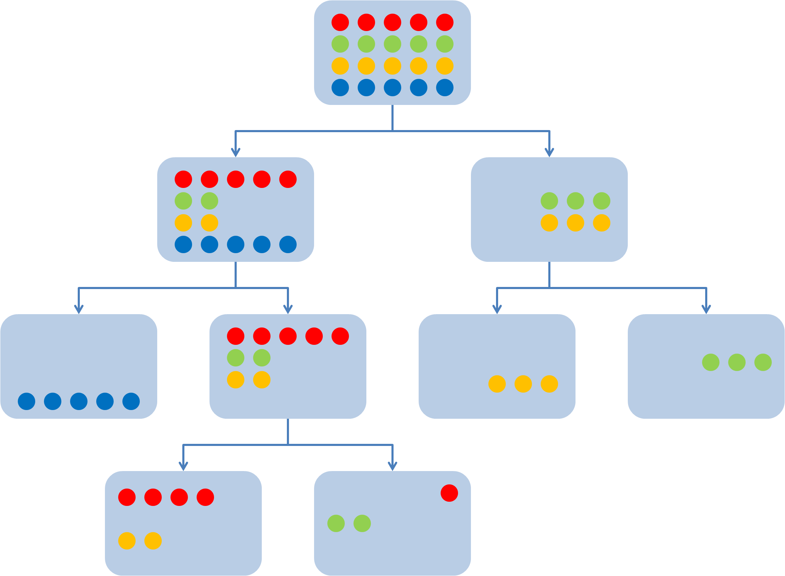
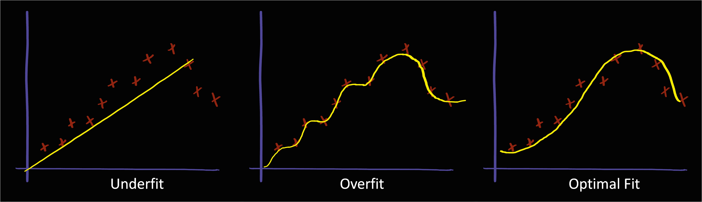
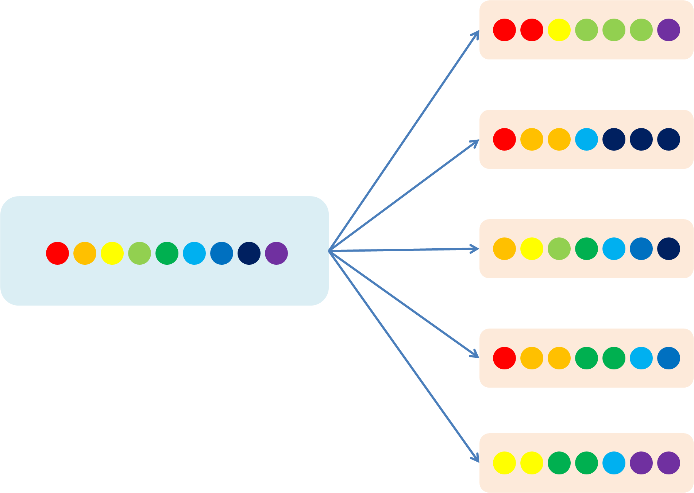
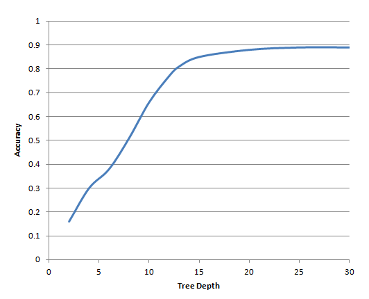
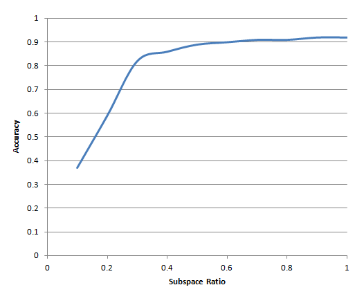
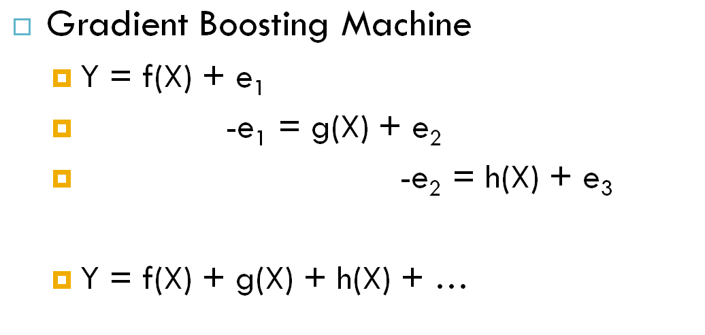
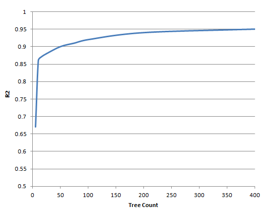
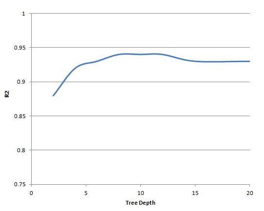
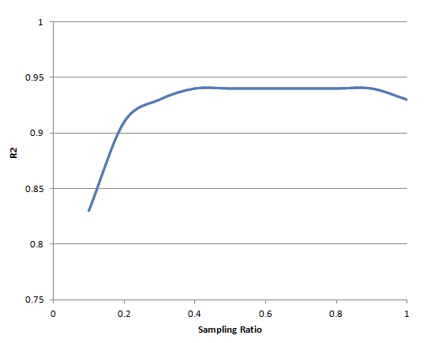
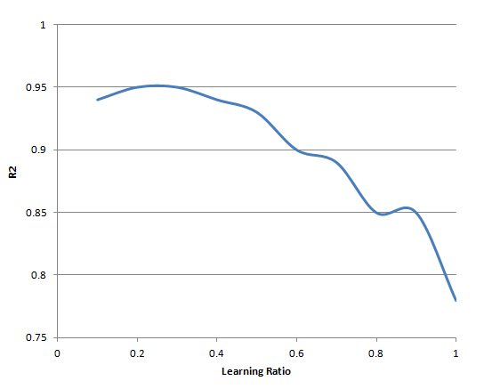

# Machine Learning in Medicine
### _A hands-on introductory course on machine learning techniques for physicians and healthcare professionals._

[](https://unsplash.com/photos/MMJx78V7xS8)
  
# Part V - Ensemble Decision Trees

## Recap
In [Part IV](part4.md) of this course, we explored the k-nearest neighbors (kNN). We demonstrated the steps to building a kNN model using the DRESS Kit as well as making predictions using the model. We made a detour to discuss the various model performance metrics, including coefficient of determination, mean absolute error, and root square mean error for regression problems as well as accuracy, precision, recall, and F score for classification problems. We also introduced the technique of cross-validation before going back to discuss the various optimization techniques specific to the kNN algorithm. Finally, we demonstrate the use of the kNN algorithm as a missing value imputation technique as well as a cohort matching technique.

Recall that one of the limitations of the linear/logistic regression model is its smooth and continuous decision boundary. A major advantage of the kNN model over the linear/logistic regression model is its ability to create a circular decision boundary of arbitrary size (based on the value of `k`). Decision tree models represent a further improvement by enabling the creation of an arbitrary decision boundary. 

## DRESS Kit Update
Before proceeding with the rest of this course, please take a moment to update the [DRESS Kit](https://github.com/waihongchung/dress) to release **1.2.9**. This version contains significant performance improvements to the random forest and gradient boosting machine algorithms.

## Decision Tree


### Model Overview
Before discussing ensemble decision trees, we must first introduce the concept of a [decision tree](https://en.wikipedia.org/wiki/Decision_tree). A decision tree is often described as a flowchart. Starting from the top of the decision tree, paradoxically called the root, the dataset is split into two groups by a certain criterion (e.g. age greater than 50, hemoglobin less than 7g/dL, gender equals male, past medical history includes diabetes, etc.), the subjects that meet the criterion belong to one group and those that do not meet the criterion belong to another group. Each group (typically referred to as a node) is split again into two by another criterion. The process is repeated until some predefined stopping criteria have been met. When we need to make a prediction using a decision tree model, we simply follow the tree starting from the root, travel all the way to an end node (a node with no further split), and compute the outcome by taking the mean (for regression problems) or mode (for classification problems) of those subjects belonging to that end node.

Intuitively, we can appreciate how the performance of a decision tree model can be affected by the choices of splitting criteria. A completely useless decision tree model is one that simply splits a node into two randomly because the predictive power of such a model would be no better than making random guesses. In order to construct a useful decision tree model, we must, therefore, try to reduce the degree of randomness after a split. There are several ways to measure randomness in a machine learning model. The most commonly used ones are [gini impurity](https://en.wikipedia.org/wiki/Decision_tree_learning#Gini_impurity) and [entropy/information gain](https://en.wikipedia.org/wiki/Decision_tree_learning#Information_gain) for classification problems and [variance](https://en.wikipedia.org/wiki/Decision_tree_learning#Variance_reduction) for regression problems. For the purpose of this course, it is not important to know the mathematics behind the Gini impurity, information gain, or variance. Suffice to say that when these metrics fall to zero, then all the subjects associated with that node have the same outcome value and there is no benefit in splitting the node further. To construct an optimal decision tree model, the algorithm simply needs to find the splitting criterion that results in the lowest degree of total randomness in their descendent nodes. 

### Strength and Limitations
We can easily see, based on the above description, how a decision tree is able to support an arbitrary decision boundary. Each node from a layer operates independently from other nodes in the same layer. Suppose we split our subjects into two groups based on a mean arterial pressure (MAP) of 60mmHg, we can then split those with low MAP by one criterion (e.g. hemoglobin level of 7g/dL) and split those with high MAP by a different criterion (e.g. a different hemoglobin level or something completely unrelated, such as gender or BMI). 

We can also see how a decision tree is essentially a cascade of if-then-else statements. This means a decision tree can operate on both numerical and categorical features (as long as you can construct an if-then-else statement based on a feature, it can function as a node in a decision tree). It also means a decision tree can operate at extreme speed during the prediction phase. There is no need for complex matrix multiplication, exponentiation, or sorting. Finally, it is easy to interpret the outcomes of a decision tree model. To understand how a prediction is made, we simply need to follow the tree from the root manually.

One minor limitation of the decision tree modeling technique is the inability to consider more than one predictor at each node. For instance, if the dataset only contains height and weight as predictors, but the outcome actually correlates better with BMI, a decision tree model may not be able to capture such a relationship efficiently. The major limitation of decision tree models, however, is a tendency to overfit. This is partly thanks to the ability of decision tree models to create an arbitrary decision boundary and partly due to the exponential increase in node count as a tree grows deeper. 



Consider a hypothetical dataset with 1000 subjects. Let's assume that each subject can be uniquely identified by a combination of the predictors, which is not totally unrealistic considering, for instance, the odds that two subjects having *exactly* the same BMI, hemoglobin level, platelet count, systolic blood pressure, heart rate, and total cholesterol level. Can we construct a decision tree model that is guaranteed to be 100% accurate when applied back to the training dataset? The answer is yes. In fact, all it takes is a decision tree with a depth of 10 (2^10 = 1024). A 20-layer tree can uniquely identify over 1 million subjects. The whole idea behind ensemble decision tree models is to overcome the fact that a single decision tree model is prone to overfitting.

## Random Forest/Extra Trees Model
### Model Overview
Random forest operates on the basic assumption that the relationship between some predictors and an outcome can be represented by a collection of decision trees (many, many trees, hence a forest), each modeling only a certain aspect of the relationship. It's kind of like the old Asian parable of the blind men and the elephant. Each man can only appreciate certain features of the elephant based on his limited interaction with the elephant, but together they describe the elephant pretty accurately. We can also think of random forest/extra trees as a sort of democracy or majority rule.

[](https://commons.wikimedia.org/wiki/File:Blind_Men_and_the_Elephant,_MET_accession_number_10_211_900_O1_sf.jpg)

The technique used to create this collection of decision trees in a random forest model is known as [bagging](https://en.wikipedia.org/wiki/Bootstrap_aggregating), which is a combination of bootstrapping and aggregation. Bootstrapping refers to the process of sampling *with replacement*. For example, we have a pool of 9 subjects and we want to create a sample of 7 by bootstrapping, we will choose one subject (e.g. subject A) *without* removing it from the pool. When we need to choose the next subject, the probability of choosing subject A again remains the same. Bootstrapping allows us to create samples that are quite different from each other and from the original dataset, but all the samples taken together should resemble the distribution of the original dataset. Suppose the gender distribution of the original dataset is 60:40, the gender distribution of each sample created by bootstrapping may not be exactly 60:40, but if we generate a lot of samples, the gender distribution of all those samples as a whole would be close to 60:40. 



A second technique used by the random forest model to minimize overfitting is known as [feature subspacing](https://en.wikipedia.org/wiki/Random_subspace_method), which simply limits the selection of features that are used by each decision tree. This prevents certain predictors that are highly correlated with the outcome to be selected as a splitting criterion in every decision tree. By using bagging and feature subspacing, the random forest algorithm can create a large number of decision trees, each trained on a sample that is derived from but not exactly identical to the dataset and only capturing the relationship between certain predictors and the outcome. During the prediction phase, the algorithm applies the testing subject to all the trees in the forest and computes the final prediction based on the mean (for regression problems) or mode (for classification problems). The idea is that relationships between the predictors and the outcome that are "important" would be captured by the majority of the trees, while those insignificant relationships would be canceled out or eliminated during the aggregation process because they are only captured by a small fracture of the forest.

[Extra Trees](https://en.wikipedia.org/wiki/Random_forest#ExtraTrees) (or extremely randomized trees) is very similar to random forest, but offers several computational advantages. In a random forest model, each decision tree still functions as a regular decision tree and splits a node based on the optimal splitting criterion, which can be computationally expensive to locate, especially for numerical features. Instead, the extra trees algorithm chooses the splitting criterion randomly. As long as the resultant decision tree performs *slightly* better than a completely useless decision tree (based on metrics like Gini impurity, entropy, and variance), it is accepted into the forest. Each tree is also trained on the entire dataset, thus eliminating the bagging step. Despite the computational advantages of extra trees, the accuracies of the two modeling techniques are comparable (examples [here](https://www.thekerneltrip.com/statistics/random-forest-vs-extra-tree/) and [here](https://mljar.com/machine-learning/extra-trees-vs-random-forest/)).

### Strengths and Limitations
The advantage of random forest/extra trees over a single decision tree is obvious - resistance to overfitting, but it does come with some drawbacks. Because models created by these two techniques are made up of hundreds of decision trees, deploying the models in a production environment can be challenging. It is also difficult to interpret the models because of the sheer number of decision trees to be analyzed as well as the fact that some trees are expected to perform poorly.

Another drawback of random forest/extra trees is the probabilistic nature of these algorithms. The linear/logistic and kNN algorithms that we have learned previously are deterministic, which means the exact same model is created every time the same training dataset is applied. In contrast, the techniques of bagging, feature subspacing, and random splitting used by the random forest/extra trees algorithms introduce a degree of randomness and create a completely different model each time the training dataset is applied. One model may perform significantly better or worsen than the next model and this makes model optimization much more challenging.

### Implementation
Enough basic theories for now and let's start building our first ensemble decision trees model. The DRESS Kit does come with a function called `DRESS.randomForest`, but it actually implements the extra trees algorithm internally for computational efficiency. 

```javascript
// Open the 'data.json' file stored on the local machine.
DRESS.local('data.json', processJSON);

function processJSON(subjects) {
    // Use of Preventive Services
    const preventions = ['ACCESS2', 'BPMED', 'CHECKUP', 'CHOLSCREEN', 'COLON_SCREEN', 'COREM', 'COREW', 'DENTAL', 'MAMMOUSE', 'PAPTEST'];
    // Unhealthy Behaviors
    const behaviors = ['BINGE', 'CSMOKING', 'LPA', 'OBESITY', 'SLEEP'];

    // Create a random forest model to predict the physical health outcome based on the use of preventive services and unhealthy behaviors
    const model = DRESS.randomForest(subjects, 'PHLTH', [...preventions, ...behaviors], [], false);

    DRESS.print(
        model // [PHLTH] seed: 1186396187
    )
}
```
Since all of our predictors are numerical, we pass them to the `DRESS.randomForest` function as the third parameter and pass an empty array as the fourth parameter (which accepts an array of categorical predictors). We also set the fifth parameter to `false` because we are building a regression model. The printout of the model itself does not contain a lot of information, except for the outcome being modeled and a `seed` value, which can be used to recreate the exact same model in the future by setting the `DRESS.SEED` global variable to that value.

```javascript
DRESS.SEED = 1186396187;
const model = DRESS.randomForest(subjects, 'PHLTH', [...preventions, ...behaviors], [], false);
DRESS.print(
    model // [PHLTH] seed: 1186396187
)
```

We can use the model to make a prediction just like any other machine learning model in the DRESS Kit.

```javascript
// Create a hypothetical city
const city = {
    ACCESS2: 40,
    BPMED: 50,
    CHECKUP: 50,
    CHOLSCREEN: 75,
    COLON_SCREEN: 65,
    COREM: 30,
    COREW: 30,
    DENTAL: 60,
    MAMMOUSE: 70,
    PAPTEST: 85,
    BINGE: 10,
    CSMOKING: 10,
    LPA: 30,
    OBESITY: 30,
    SLEEP: 30        
}

DRESS.print(
    model.predict(city)
)
```

To create a classification model, we simply set the fifth parameter to the `DRESS.randomForest` function as `true`.

```javascript
// Open the 'data.json' file stored on the local machine.
DRESS.local('data.json', processJSON);

function processJSON(subjects) {
    // Use of Preventive Services
    const preventions = ['ACCESS2', 'BPMED', 'CHECKUP', 'CHOLSCREEN', 'COLON_SCREEN', 'COREM', 'COREW', 'DENTAL', 'MAMMOUSE', 'PAPTEST'];
    // Unhealthy Behaviors
    const behaviors = ['BINGE', 'CSMOKING', 'LPA', 'OBESITY', 'SLEEP'];

    // Create a random forest model to predict the state based on the use of preventive services and unhealthy behaviors
    const model = DRESS.randomForest(subjects, 'state', [...preventions, ...behaviors], [], true);
}
```

### Optimizations
Before we discuss the various optimizations that can be done on our random forest (in reality extra trees) model, let's recall how we can use `DRESS.crossValidate` and `DRESS.async` to assess the performance of a machine learning model. Turns out, the default hyperparameter settings are far from optimized for what we are trying to do.

```javascript
// Open the 'data.json' file stored on the local machine.
DRESS.local('data.json', processJSON);

function processJSON(subjects) {
    // Use of Preventive Services
    const preventions = ['ACCESS2', 'BPMED', 'CHECKUP', 'CHOLSCREEN', 'COLON_SCREEN', 'COREM', 'COREW', 'DENTAL', 'MAMMOUSE', 'PAPTEST'];
    // Unhealthy Behaviors
    const behaviors = ['BINGE', 'CSMOKING', 'LPA', 'OBESITY', 'SLEEP'];

    // Parameters to be used to create a random forest model
    const training_parameters = ['state', [...preventions, ...behaviors], [], true];

    // Parameters to be used for validation
    const validation_parameters = [];

    DRESS.print(
        // Calling DRESS.crossValidate asynchronously. Note that the function name is passed as a string. Also note that DRESS.randomForest function name must be contained by an object with a property named `async`.
        DRESS.async('DRESS.crossValidate', { async: 'DRESS.randomForest' }, subjects, training_parameters, validation_parameters)        
    );
}
```

#### Tree Count
The first optimization that comes to mind is the number of trees in the forest. Intuitively, we can see that if the model is made up only of a few trees (e.g. 5-10 trees) and each tree only operates on a subset of predictors, the final model may fail to capture certain aspects of the relationship between the predictors and the outcome. Once we have reached a sufficient number of trees, however, further increases tend not to improve the overall performance, but instead, dramatically reduces the efficiency of the model. Training 1000 trees is going to take ten times the computational power it takes to train 100 trees, but it is unlikely to increase the accuracy by 10 folds. In general, we can start with 50-100 trees, then progressively increase the number of trees by doubling it until the model performance starts to plateau. 


#### Tree Depth
Tree depth plays a far more important role in optimization than tree count. Intuitively, we can see that if the tree depth is set to 1, then each tree will only have 2 end nodes. Even with a large number of trees, the model would not be very accurate because the outcome values at either end of a normal distribution curve would be outweighed by those near the mean. This problem is particularly crucial to multiclass classification models with an uneven class distribution. Because the final prediction of the model is computed by taking the mode from all the trees, if the number of end nodes in each tree is significantly smaller than the number of classes, those rare classes would almost never be selected as the mode. In contrast, if the tree depth is set too high, overfitting may become more pronounced. 



#### Subspace Ratio
An equally important optimization for the random forest/extra trees algorithm is the feature subspace ratio because it is one of the primary sources of randomness to the final model (bagging ratio and random split criteria being the other source for random forest and extra trees, respectively). In other words, the subspace ratio controls the balance between underfitting and overfitting. Consider a model that is made up of a combination of strong predictors and weak predictors, by setting the subspace ratio to 1, the weak predictors are likely to be included in some trees, the resultant model would be very accurate when applied back to the training dataset, but would perform poorly when applied to an independent validation dataset, i.e. overfit. If the subspace ratio is set to 0, then the model is completely useless because it does not take any predictors into account. A great deal of trial and error is needed to determine the optimal subspace ratio for a particular model.



#### Feature Selection
Like any other machine learning model, feature selection is fundamental to the performance of the model. As it is with the case of a single decision tree, ensemble decision trees can only split a node based on one predictor at a time, it is, therefore, important to supply the appropriate predictors (e.g. height and weight vs. BMI) to the algorithm. Compared to linear/logistic regression and kNN, decision tree models are less affected by weak predictors (provided that the subspace ratio hyperparameter is tuned appropriately) and are not affected by feature scaling at all. 

## Gradient Boosting Machine
### Model Overview



Although it is still considered an ensemble decision tree model, gradient boosting machine is very different from random forest/extra trees. Instead of being a democracy in which the majority rules, each decision tree is trying to reduce the error produced by the previous decision trees. Decision trees in a gradient boosting machine are arranged in a chain. The first decision tree operates just like any other single decision tree by modeling the relationship between the predictors and the outcome. The second decision tree models the residual error produced by the first decision tree, but in the opposite direction (i.e. positive becomes negative and negative becomes positive). Then the training set is applied to the first and second decision trees altogether and the residual error is modeled by a third decision tree (again in the opposite direction). This process is repeated until the residual error is negligible or the predefined number of trees has been added.

### Strengths and Limitations
When tuned properly, gradient boosting machines appear to outperform random forest/extra trees models based on results from many machine learning competitions on [Kaggle](https://www.kaggle.com). This increased performance, however, comes with a price. Training time for gradient boosting machine is much longer than random forest/extra trees because the entire training dataset must be applied to the working model every time a new tree is created in order to compute the residual error. The training phase cannot be parallelized because each tree is dependent on the residual error produced by prior trees. Gradient boosting machine also does not work well with multiclass classification problems because each class requires a separate chain of decision trees in a one-vs-rest fashion. It is also much more difficult to interpret the resultant model because, except for the first decision tree, the model focuses on the relationship between the predictors and the residual errors, not the outcome values. Finally, gradient boosting machines are more prone to overfitting than random forest/extra trees models. 

### Implementation
Creating a gradient boosting machine requires almost no changes to the code used to create a random forest/extra trees model, other than calling `DRESS.gradientBoosting` instead of `DRESS.randomForest`. Note that the code takes significantly longer to complete because of the processing time it takes to apply the entire training dataset every time a new decision tree is created.

```javascript
// Open the 'data.json' file stored on the local machine.
DRESS.local('data.json', processJSON);

function processJSON(subjects) {
    // Use of Preventive Services
    const preventions = ['ACCESS2', 'BPMED', 'CHECKUP', 'CHOLSCREEN', 'COLON_SCREEN', 'COREM', 'COREW', 'DENTAL', 'MAMMOUSE', 'PAPTEST'];
    // Unhealthy Behaviors
    const behaviors = ['BINGE', 'CSMOKING', 'LPA', 'OBESITY', 'SLEEP'];

    // Create a gradient boosting machine to predict the physical health outcome based on the use of preventive services and unhealthy behaviors
    const model = DRESS.gradientBoosting(subjects, 'PHLTH', [...preventions, ...behaviors], [], false);

    // Create a hypothetical city
    const city = {
        ACCESS2: 40,
        BPMED: 50,
        CHECKUP: 50,
        CHOLSCREEN: 75,
        COLON_SCREEN: 65,
        COREM: 30,
        COREW: 30,
        DENTAL: 60,
        MAMMOUSE: 70,
        PAPTEST: 85,
        BINGE: 10,
        CSMOKING: 10,
        LPA: 30,
        OBESITY: 30,
        SLEEP: 30
    };

    // 
    DRESS.print(
        model,
        model.predict(city),
    );
}
```

### Optimization
#### Tree Count
As a general rule of thumb, gradient boosting machines can achieve a comparable level of performance as random forest/extra trees models using much fewer decision trees. This is partly because of the fact that, by design, not all decision trees in a random forest/extra trees model are useful, while in a gradient boosting machine, every decision tree reduces the residual error by a certain amount. Adding too many trees to a gradient boosting machine can increase the training time dramatically (as the residual error decreases, it may be more difficult to create an optimal decision tree) and can eventually lead to overfitting.



#### Tree Depth
Just like tree count, gradient boosting machines can often achieve a comparable level of performance as random forest/extra trees model using shallower decision trees. This is due to the fact that the residual errors tend to cluster around the central limit after a few trees, as a result, the degree of randomness (i.e. mean squared error) that needs to be handled by each tree is small. Having an excessively deep tree is a common reason for overfitting in gradient boosting machine.



#### Subspace Ratio
Subspace ratio works somewhat differently for gradient boosting machines than it does for random forest/extra trees models, at least that is the case for the DRESS Kit implementation. Subspace ratio is applied to the training dataset, instead of the features, during the training phase. Because each decision tree only models the residual errors from a subset of the training dataset, choosing a small subspace ratio could reduce the training time. As expected, choosing a large subspace ratio tends to result in overfitting. 



#### Learning Rate
Learning rate determines how much of the residual errors is being modeled by each decision tree. It is generally set to a small number between 0.1 to 0.3, which means each decision tree will only attempt to account for 10-30% of the residual errors, and the remaining 70-90% of residual errors will be handled by subsequent decision trees that operate on different subsets of the training dataset (as determined by the subspace ratio hyperparameter). In fact, these two hyperparameters represent the main safeguard against overfitting for gradient boosting machines. Setting the learning rate too low, however, would result in underfitting or require compensation by a high tree count, which reduces the model's efficiency.



## Feature Importance
Recall our discussion on the conceptual differences between using linear/logistic regression as a machine learning model and using it as a traditional regression analysis technique in [Part III](part3.md) of the course. Although machine learning models are not designed to evaluate the presence/absence of a *statistically significant* association between a predictor/feature and an outcome, sometimes it is still useful to figure out if a particular feature/predictor is important or not. If a particular feature is deemed unimportant, then it may be more efficient to rebuild the model without said feature. In a linear/logistic model, it is easy to identify those unimportant features. In a kNN model, every feature is equally important (unless certain features are scaled differently and the normalization flag is turned off). How can we objectively measure the importance of a feature in an ensemble decision tree model?

Remember that the goal of a decision tree is to reduce the degree of randomness in the dataset. One way to measure feature importance is by calculating the reduction in the degree of randomness associated with each feature. In a classification model, for instance, we can compute the Gini impurity of the entire training dataset as well as the Gini impurity after each split. The difference in Gini impurity before and after each split reflects the degree of randomness reduced by the feature being used as the splitting criterion. We simply need to compute the total reduction in Gini impurity associated with each feature in order to quantify its importance. In a regression model, we can achieve the same result by computing the difference in variance before and after each split. 

Conveniently, the ensemble decision tree models created by the DRESS Kit come with a built-in function (`model.importance`) that automatically calculates feature importance based on Gini impurity or variance. 

```javascript
// Open the 'data.json' file stored on the local machine.
DRESS.local('data.json', processJSON);

function processJSON(subjects) {
    // Use of Preventive Services
    const preventions = ['ACCESS2', 'BPMED', 'CHECKUP', 'CHOLSCREEN', 'COLON_SCREEN', 'COREM', 'COREW', 'DENTAL', 'MAMMOUSE', 'PAPTEST'];
    // Unhealthy Behaviors
    const behaviors = ['BINGE', 'CSMOKING', 'LPA', 'OBESITY', 'SLEEP'];

    // Create a random forest model to predict the state based on the use of preventive services and unhealthy behaviors
    const model = DRESS.randomForest(subjects, 'PHLTH', [...preventions, ...behaviors], [], false);

    // Report feature importance
    DRESS.print(
        model.importance()
    )
}
```

```
LPA         : 1209.08
OBESITY     : 1038.83
DENTAL      : 1020.85
CSMOKING    : 877.34
COLON_SCREEN: 605.89
COREW       : 584.14
BINGE       : 573.65
SLEEP       : 464.21
COREM       : 383.77
BPMED       : 380.73
ACCESS2     : 311.41
CHECKUP     : 149.87
PAPTEST     : 128.30
CHOLSCREEN  : 110.00
MAMMOUSE    : 60.40
```

Based on the printout, we can conclude that `LPA` (No leisure-time physical activity among adults aged >=18 Years) is the most important predictor in the model and is several orders of magnitude more important than `MAMMOUSE`. If we build two models, one with and one without the `MAMMOUSE` predictor, we can see that there is no difference in performance between the two models.

```javascript
// Open the 'data.json' file stored on the local machine.
DRESS.local('data.json', processJSON);

function processJSON(subjects) {
    // Use of Preventive Services
    const preventions = ['ACCESS2', 'BPMED', 'CHECKUP', 'CHOLSCREEN', 'COLON_SCREEN', 'COREM', 'COREW', 'DENTAL', 'MAMMOUSE', 'PAPTEST'];

    // Use of Preventive Services without MAMMOUSE
    const preventions_2 = ['ACCESS2', 'BPMED', 'CHECKUP', 'CHOLSCREEN', 'COLON_SCREEN', 'COREM', 'COREW', 'DENTAL', 'MAMMOUSE', 'PAPTEST'];
    // Unhealthy Behaviors
    const behaviors = ['BINGE', 'CSMOKING', 'LPA', 'OBESITY', 'SLEEP'];

    // Parameters to be used to create a random forest model with all predictors
    const training_parameters = ['PHLTH', [...preventions, ...behaviors], [], false];

    // Parameters to be used to create a random forest model withtout the MAMMOUSE predictor
    const training_parameters_2 = ['PHLTH', [...preventions_2, ...behaviors], [], false];

    // Parameters to be used for validation
    const validation_parameters = [];

    DRESS.print(
        DRESS.async('DRESS.crossValidate', { async: 'DRESS.randomForest' }, subjects, training_parameters, validation_parameters)
    );

    DRESS.print(
        DRESS.async('DRESS.crossValidate', { async: 'DRESS.randomForest' }, subjects, training_parameters_2, validation_parameters)
    );
}
```

## Wrap Up
Let's review what we have learned in Part V. we introduced the concept of a decision tree as a machine learning model and discussed its strengths and limitations, particularly the risk of overfitting. We discussed how the random forest model is designed to reduce the risk of overfitting by using techniques such as bagging and feature subspacing. We also introduced the extra trees model and explained how it can be used as a more computational efficient substitute for random forest. We proceeded to demonstrate the code for building an extra trees model using `DRESS.randomForest` and discussed the various points of optimization. We then moved on to discussing another ensemble decision tree model, the gradient boosting machine, and how it compares to the random forest/extra trees model. We again demonstrated the code for building a gradient boosting machine `DRESS.gradientBoosting` and discussed its optimization. Finally, we went over the steps to assess feature importance using the `model.importance` function.

## Model Summary
*Random Forest/Extra Trees*
- Strengths
    - Support arbitrary decision boundary
    - Works with numerical and categorical predictors
    - Very fast to make predictions
    - Less prone to overfitting

- Limitations
    - Difficult to interpret (many trees are involved, some perform poorly by design)
    - Difficult to optimize (many hyperparameters to consider, the algorithm is not deterministic)

*Gradient Boosting Machine*
- Strengths
    - Support arbitrary decision boundary
    - Works with numerical and categorical predictors
    - Very fast to make predictions
    - Better performance than random forest/extra trees

- Limitations
    - Still prone to overfitting
    - Much slower to train
    - Difficult to interpret (most trees model residual errors instead of the outcome)
    - Difficult to optimize (many hyperparameters to consider, the algorithm is not deterministic)

## Exercise
As an exercise, try to create a random forest model and a gradient boosting machine to predict the prevalence of cancer in a hypothetical city/town. Focus on optimizing the models by adjusting the various hyperparameters in a systematic fashion. It may be useful to create a table to keep track of the changes in model performance as the values of the hyperparameters varies.