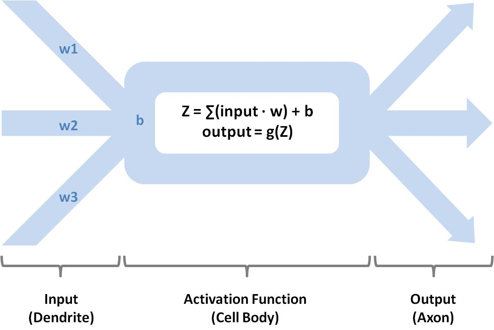
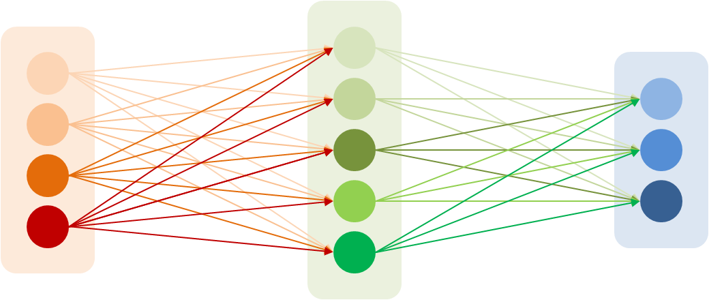
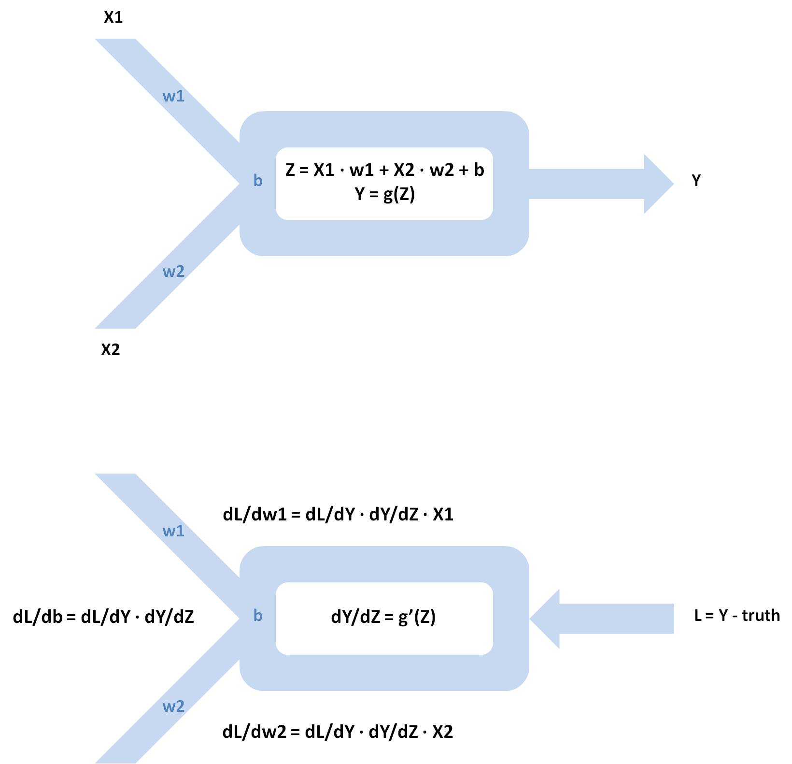

# Machine Learning in Medicine
### _A hands-on introductory course on machine learning techniques for physicians and healthcare professionals._

[](https://unsplash.com/photos/OgvqXGL7XO4)
  
# Part VI - Artificial Neural Network

## Recap
In [Part V](part5.md) of this course, we explored two ensemble decision tree algorithms, random forest/extra trees and gradient boosting machine. We started by discussing the strengths and, more importantly, the limitations, of single decision tree models. We introduced the concepts of bagging and subspacing as means to minimize overfitting. We demonstrated the steps to building a random forest/extra trees model as well as a gradient boosting machine using the DRESS Kit. We also went into the various optimization techniques for both modeling techniques. We finished by discussing the concept of and the algorithm for computing feature importance.

A major advantage of ensemble decision tree models over kNN and logistic/linear regression is their ability to support an arbitrary decision boundary, but each node in a decision tree can only operate on one feature at a time. Artificial neural networks represent a further improvement enabling high levels of abstraction. 

## DRESS Kit Update
Before proceeding with the rest of this course, please take a moment to update the [DRESS Kit](https://github.com/waihongchung/dress) to release **1.3.0**. This version contains significant feature improvements and changes to the neural network algorithms as well as the addition of new data transformation algorithms.

## Model Overview
An artificial neural network works on the assumption that there exists a computable function that maps the predictors to the outcome. As its name suggested, an artificial neural network is inspired by a biological neural network. Each artificial neuron, the basic operating unit of an artificial neural network, is a functional abstraction of a biological neuron. It accepts one or more inputs from upstream neurons in the network the same way a biological neuron accepts signals from upstream neurons through its dendrites. In a biological neuron, if the membrane potential reaches a certain depolarization threshold, an action potential is fired and transmitted along the axons to downstream neurons. In an artificial neuron, the inputs are processed by an activation function (plus some other mathematical manipulations) and the output is transmitted to downstream neurons.



The first question that comes to mind is how a network of interconnected artificial neurons is able to learn anything. The key lies in the abovementioned mathematical manipulations. Each input is multiplied by a weight factor that is intrinsic to the connection between two neurons and another factor intrinsic to each neuron, called bias, is added to the sum of all the weighted inputs before the final value is processed by the activation function. A neural network can 'learn' new information by adjusting these weights and biases. 

It is important to note that artificial neural network is just an umbrella term. Depending on how the artificial neurons are connected to one another, various machine learning models can be created. The most basic and commonly used type of artificial neural network is called multilayer perceptron. 



In a multilayer perceptron, neurons are arranged in discrete layers. All the neurons in the same layer share the same activation function. Each neuron in a particular layer is connected to all the neurons in the next layer. To create a multilayer perceptron, one must first decide on the number of layers, the number of neurons in each layer, and the activation function used in each layer. The weights and biases in the network are first initialized to some random values. Training samples are then fed into the model, either sequentially or in batches, and the output of the model is compared against the true values in the training dataset. Initially, the output of the model would be highly inaccurate, but the error is back-propagated through the model to every layer of neurons in the network. The weight associated with each connection and the bias associated with each neuron is adjusted in order to reduce the error of the whole network. By repeating these forward propagation and backward propagation steps many times, a multilayer perceptron can slowly learn the relationship between the predictors and the outcome values.



The detailed mathematics behind the backward propagation process is rather complex and involves solving an array of partial derivatives. Suffice the say that the results of these derivative functions allow the weights and the biases to be adjusted in the opposite direction to and in proportion to the error of the output of each neuron.

## Strengths and Limitations
The greatest strength of multilayer perceptron, and artificial neural networks in general, is its ability to support high-level abstractions. In fact, artificial neural networks are considered [universial function approximators](https://en.wikipedia.org/wiki/Universal_approximation_theorem), meaning that they can approximate almost any known function given a sufficient amount of interconnected neurons and layers. In other words, an artificial neural network can, in theory, model any relationship between the predictors and the outcome, even if the relationship is essentially random in nature.

Another strength of the multilayer perceptron is its ability to model multiple outcomes at the same time, by setting the output layer of the network to the desired number of outcomes and specifying the appropriate loss function. This can be quite handy if we need to build a model to predict several different, but somewhat related outcomes. For instance, we can build a model to predict both 30-day mortality and 1-year all-cause mortality after an episode of spontaneous bacterial peritonitis.

This ability to approximate any relationship between the predictors and the outcome comes with several important trade-offs. First of all, training a multilayer perceptron is computationally expensive. Each forward and backward propagation involves multiple matrix calculations. A significantly larger training dataset is often needed to train an artificial neural network compared to an ensemble decision tree model. The training process typically involves repeating the entire training dataset hundreds or thousands of times.

Second, artificial neural networks are notoriously difficult to optimize. One has to consider the number of layers of neurons, the number of neurons in each layer, the choice of activation function in each layer, the method of weight/bias initialization, the learning rate, the dropout rate, the number of training cycles, the loss function, as well as an array of other advanced optimization parameters. Given the abovementioned long training time, it is often difficult to systematically test all permutations of hyperparameters.

Third, artificial neural networks function as a black box. It is practically impossible to interpret how and why a certain decision is made by a neural network by inspecting the values of those weights and biases. In fact, two neural networks of the same structure trained on the same dataset and having similar performance may have vastly different sets of weights and biases. Additionally, because each neuron is connected to all the neurons in the downstream layer, the predictors are all mixed up in the deeper layers of the networks. It is impossible to identify exactly how one particular predictor affects the outcome of the network.

Fourth, artificial neural networks only work on numerical predictors and require a lot of data preparation (normalizing the values of different predictors and transforming their distributions) in order to achieve good results. 

## Implementation
Let's start building our multilayer perceptron. As we mentioned earlier, training a neural network is computationally expensive, so it is best to do it asynchronously in order to avoid the script timeout error. 

```javascript
// Open the 'data.json' file stored on the local machine.
DRESS.local('data.json', processJSON);

function processJSON(subjects) {
    // Use of Preventive Services
    const preventions = ['ACCESS2', 'BPMED', 'CHECKUP', 'CHOLSCREEN', 'COLON_SCREEN', 'COREM', 'COREW', 'DENTAL', 'MAMMOUSE', 'PAPTEST'];
    // Unhealthy Behaviors
    const behaviors = ['BINGE', 'CSMOKING', 'LPA', 'OBESITY', 'SLEEP'];

    // Create a Multilayer Perceptron to predict the physical health outcome based on the use of preventive services and unhealthy behaviors
    DRESS.print(
        // Calling DRESS.multilayerPerceptron asynchronously
        DRESS.async('DRESS.multilayerPerceptron', subjects, 'PHLTH', [...preventions, ...behaviors], false).then(result => {
            // Rebuild the asynchronous model
            const model = DRESS.multilayerPerceptron(result);

            // Create a hypothetical city
            const city = {
                ACCESS2: 40,
                BPMED: 50,
                CHECKUP: 50,
                CHOLSCREEN: 75,
                COLON_SCREEN: 65,
                COREM: 30,
                COREW: 30,
                DENTAL: 60,
                MAMMOUSE: 70,
                PAPTEST: 85,
                BINGE: 10,
                CSMOKING: 10,
                LPA: 30,
                OBESITY: 30,
                SLEEP: 30
            };

            // Make a prediction using the rebuilt model
            return model.predict(city);
        })
    );
}
```

The script is slightly different from the one we used to create a random forest/extra trees model or a gradient boosting machine. Let's walk through the changes in detail. Instead of calling the `DRESS.multilayerPerceptron` function directly, we call `DRESS.async`, which is a utility function in the DRESS Kit that enables asynchronous function call. The first parameter is the name of the DRESS Kit function that we want to run asynchronously. It is important to note that we are NOT passing the actual function as a parameter, just the name of the function as a string. The subsequent parameters are passed the same way we would if we were to call `DRESS.multilayerPerceptron` synchronously. The `DRESS.async` function returns a JavaScript [Promise](https://developer.mozilla.org/en-US/docs/web/javascript/reference/global_objects/promise), which will eventually resolve into a result object once the function has completed. It may be worthwhile to review the basic concepts of asynchronous programming [here](https://developer.mozilla.org/en-US/docs/Learn/JavaScript/Asynchronous/Promises). In order to act upon the result object, we need to call the `.then` function associated with the Promise object and pass an [arrow function](https://developer.mozilla.org/en-US/docs/Web/JavaScript/Reference/Functions/Arrow_functions) as a parameter. The arrow function is expected to receive the result object as a parameter. 

Due to the inherent limitations of JavaScript, the result object resolved by the Promise object does not contain any executable function. Before we can call the `model.predict` function or another function associated with the model, we must rebuild the model. Fortunately, it can be done easily and efficiently by passing the result object into `DRESS.multilayerPerceptron` again synchronously. We pass the entire Promise object together with the `then` function to `DRESS.print`, which will automatically display a timer to help us keep track of the progress of the asynchronous function call. We return the result of the prediction from within the `then` function so that it can be displayed by the `DRESS.print` function as well.

We can build a classification model by substituting the outcome to `state` and the classification flag to `true`, but it is important to note that the training time of a classification model is substantially higher because the number of neurons needed to build a model of all 50 states is many folds larger.

## Online Training
During the training phase of an artificial neural network, each training sample is applied to update the weights and biases of the network and is no longer needed afterward. As a result, the training process of an artificial neural network can occur sequentially. Instead of applying the entire dataset all at once, we can train the model with a small dataset (or even just one sample), test the performance of the model, and apply more training samples once they become available and necessary. 

```javascript
// Open the 'data.json' file stored on the local machine.
DRESS.local('data.json', processJSON);

function processJSON(subjects) {
    // Divide the dataset into 100 batches
    const batchSize = Math.round(subjects.length / 100);

    // Randomize subjects
    subjects.sort(_ => Math.random() - 0.5);

    // Use of Preventive Services
    const preventions = ['ACCESS2', 'BPMED', 'CHECKUP', 'CHOLSCREEN', 'COLON_SCREEN', 'COREM', 'COREW', 'DENTAL', 'MAMMOUSE', 'PAPTEST'];
    // Unhealthy Behaviors
    const behaviors = ['BINGE', 'CSMOKING', 'LPA', 'OBESITY', 'SLEEP'];

    // Create multilayer perceptron using the first batch
    const model = DRESS.multilayerPerceptron(subjects.slice(0, batchSize), 'PHLTH', [...preventions, ...behaviors], false);

    // Loop through remaining 99 batches
    let train = (i) => {
        if (i < 100) {
            const start = batchSize * i;
            const end = start + batchSize;
            // Test the performance using a new batch        
            DRESS.print(
                model.performance(subjects.slice(start, end))
            );

            // Apply the new batch to the model
            model.train(subjects.slice(start, end));

            // Repeat the training process.
            setTimeout(train, 0, i + 1);
        } else {
            DRESS.print(
                model
            );
        }
    };
    //
    train(1);
}
```

We can simulate this online training behavior by dividing the training dataset into multiple batches and applying one batch at a time. First, we build a multilayer perceptron using the first batch of training samples by calling `DRESS.multilayerPerceptron`, then test the performance using `model.performance`, and apply additional training samples using `model.train`. We can see from the printout that the performance of the model fluctuates quite a bit during the first few batches, but it improves and converges towards the end of the training process. 

It is important to note that to build a classification model using this online training method, we must ensure that the first batch of training samples contains all possible outcome values since the output layer of the neural network is set when the model is first built by the `DRESS.multilayerPerceptron` function. Applying additional training samples via `model.train` does not change the layout of the neural network.

## Optimization
Optimizing an artificial neural network can be quite challenging. We will start by evaluating the baseline performance of our model. Note that the cross-validation time is quite long since the algorithm needs to build and train five separate models.

```javascript
// Open the 'data.json' file stored on the local machine.
DRESS.local('data.json', processJSON);

function processJSON(subjects) {
    // Use of Preventive Services
    const preventions = ['ACCESS2', 'BPMED', 'CHECKUP', 'CHOLSCREEN', 'COLON_SCREEN', 'COREM', 'COREW', 'DENTAL', 'MAMMOUSE', 'PAPTEST'];    
    // Unhealthy Behaviors
    const behaviors = ['BINGE', 'CSMOKING', 'LPA', 'OBESITY', 'SLEEP'];

    // Parameters to be used for training
    const training_parameters = ['PHLTH', [...preventions, ...behaviors], false];
    // Parameters to be used for validation
    const validation_parameters = [];

    DRESS.print(
        DRESS.async('DRESS.crossValidate', { async: 'DRESS.multilayerPerceptron' }, subjects, training_parameters, validation_parameters)                
    );

}
```

Before we look into each hyperparameter in detail, it's important to emphasize that some optimization techniques may be implementation-specific, meaning depending on the underlying codes, certain optimization may be of higher yield than others and certain hyperparameters may not be available due to implementation-specific limitations. For instance, the DRESS Kit implementation of multilayer perceptron only supports the [Adam Optimizer](https://optimization.cbe.cornell.edu/index.php?title=Adam), but there exist several other optimizers, such as [RMSProp(https://optimization.cbe.cornell.edu/index.php?title=RMSProp) and [AdaGrad](https://en.wikipedia.org/wiki/Stochastic_gradient_descent#Extensions_and_variants). 

### Network Layout
The first thing we need to consider while designing a neural network is the structure of the neural network. Typically, the input layer of a multilayer perceptron is set to the same size as the number of predictors in the model, while the output layer is set to the size of one in a regression model or to the number of distinct classes in a classification model. There are essentially no limitations or restrictions on the number of neurons in the hidden layers (layers between the input and the output). In an overly simplified way, we can view each neuron in a hidden layer as a decision-making unit controlling how the input signal flows towards the output layer. By increasing the number of neurons in each layer, the network can, in theory, handle a more complex relationship between the predictors and the outcome. The downside of having a large number of neurons is, of course, a longer training time. Having too many neurons can also lead to overfitting, although it is, in general, less of an issue for multilayer perceptron thanks to other [regularization techniques](https://en.wikipedia.org/wiki/Regularization_%28mathematics%29).

Increasing the number of layers in a multilayer perceptron also increases the network's ability to handle complex problems, but in a different way. Since each neuron from a hidden layer is fully connected to all neurons in the adjacent layers, neurons in the deeper layers are making decisions based on a combination of multiple predictors at the same time. Thus, adding layers enables the network to achieve higher levels of abstraction. It is important to note, however, that adding additional layers increases the training time exponentially. (i.e. a network with one hidden layer of size 10 and another hidden layer of size 20 has 200 connections, while a network with three hidden layers of size 10 has 1,000 connections).In general, a multilayer perceptron with 2-3 hidden layers is sufficient for most applications.

```javascript
    // Parameters to be used to create a random forest model
    const training_parameters = ['PHLTH', [...preventions, ...behaviors], false, {layout: [10, 10]}];
```

By default, the DRESS Kit implementation of multilayer perceptron has two hidden layers and the algorithm uses a simple heuristic to determine the appropriate number of neurons per layer. We can change the structure of our model by specifying the `layout` hyperparameter. Here are the results of several different layouts that we have tried. We can see that the [coefficient of determination](https://en.wikipedia.org/wiki/Coefficient_of_determination) (R2) of the network, based on 5-fold cross-validation, does not vary significantly despite adding substantially more neurons from [5, 3] (meaning a hidden layer of 5 neurons followed by a hidden layer of 3 neurons) to [20, 10] (a hidden layer of 20 neurons followed by a hidden layer of 10 neurons). Meanwhile, the training time is nearly quadruple. Interestingly, we also see that adding extra layers actually worsens the performance and drives the training time up exponentially.

```
[5]          R2 0.94
[7]          R2 0.95
[10]         R2 0.96
[15]         R2 0.96
[3, 3]       R2 0.93
[5, 3]       R2 0.94
[7, 5]       R2 0.94
[10, 5]      R2 0.95
[10, 10]     R2 0.96
[20, 10]     R2 0.96
[7, 5, 3]    R2 0.95
[10, 7, 5]   R2 0.94
[7, 5, 5, 3] R2 0.93
```

### Activation Function
The next hyperparameter to consider while designing a neural network is the activation function being used. The main purpose of an activation function is to introduce nonlinearity to the network. There are a wide array of [activation functions](https://en.wikipedia.org/wiki/Activation_function), each with its own distinct operating characteristics. The good news is the Leaky Rectified Linear Unit (Leaky ReLU) has been shown to offer superior performance compared to other activation functions in most cases. Unless there are very specific reasons to consider another activation function, it is generally safe to use Leaky ReLU in all hidden layers of a multilayer perceptron.

### Epoch
There are several ways to apply the training dataset to the network during the training process. In the traditional gradient descent algorithm, the entire dataset is applied to the network all at once and the average loss is backpropagated to update the weights and biases of all neurons. This method requires a lot of memory and computational power. An alternative method, known as [Stochastic Gradient Descent](https://en.wikipedia.org/wiki/Stochastic_gradient_descent), is to perform the forward and backward propagation on one sample at a time. There is also batch gradient descent, in which the samples are applied in small batches. No matter how the training dataset is applied, it is not sufficient to apply it through the network only once. It takes many cycles, or epochs, in order to optimize the weights and biases of all the neurons. Obviously, if the epoch is set too high, the training process would be very slow and it also increases the risk of overfitting.

```
25          R2 0.92
50          R2 0.93
100         R2 0.94
250         R2 0.95
500         R2 0.96
```

### Dilution
There are many regularization techniques for reducing overfitting in an artificial neural network, one of which is [dilution](https://en.wikipedia.org/wiki/Dilution_(neural_networks)). The concept of dilution is somewhat similar to the concept of subspacing in ensemble decision tree models. It involves shutting off a small group of neurons randomly during the training process, such that the weights of those neurons are not contributing to the output. The end result is that each neuron is only trained on a portion of the entire training dataset during each cycle and those neurons that are not turned off during a particular cycle are forced to learn additional information. An unintended benefit of dilution is that by shutting off certain neurons, the training time is also reduced slightly because there is no need to perform backward propagation on those neurons.

```
0.10         R2 0.94
0.25         R2 0.95
0.50         R2 0.96
0.75         R2 0.95
0.90         R2 0.94
```

### Learning Rate
Most neural network implementations support a learning rate hyperparameter, sometimes known as `alpha`. The idea is similar to that of the ensemble decision tree models. It limits the amount by which the weights and biases can change during each backpropagation. This minimizes the effects of outliers and prevents the values of those weights and biases from fluctuating excessively (and causing some neurons to be shut off in case of ReLU activation). A high learning rate may cause the gradient descent algorithm to oscillate around, instead of converging to, the optimal point, while a low learning rate may require compensation by a high epoch count (and thus a longer training time).

```
0.0005       R2 0.95
0.001        R2 0.95
0.005        R2 0.95
0.01         R2 0.94
0.05         R2 0.88
```

### Momentum 
The vanilla stochastic gradient descent algorithm can be slow to converge to an optimal point if the learning rate is small. Ideally, the algorithm should start with a higher learning rate at the beginning and progressively decrease the rate as it reaches closer to the optimal point. A number of momentum-based optimizer algorithms use this technique to speed up the training process. The Adam optimizer used by the DRESS Kit implementation supports momentum-related hyperparameters `beta1` and `beta2`. The default values for these hyperparameters are appropriate for most use cases.

## Other Types of Artificial Neural Network
As we have mentioned earlier, multilayer perceptron is just one of many types of artificial neural networks. Most multilayer perceptrons are able to perform well with only a few hidden layers. Although there is no formal definition, multilayer perceptrons that contain many (e.g. dozens) of hidden layers are sometimes known as a deep neural network. 

Besides building classification and regression models, an artificial neural network can also perform other tasks. Autoencoder is a type of artificial neural network that performs unsupervised learning tasks, such as dimensionality reduction and feature extraction. A convolutional neural network is typically used in image processing because it is sensitive to the spatial relationships amongst features. A generative adversarial network can be used to generate new samples with the same statistics as the training dataset.

## Wrap Up
Let's review what we have learned in Part VI. We discussed the basic anatomy of an artificial neural network and explained how a network of interconnected artificial neurons is able to perform learning through forward and backward propagation. We demonstrated the code to build a multilayer perceptron asynchronously using `DRESS.multilayerPerceptron` and `DRESS.async`. We also demonstrated the code to build and train a multilayer perceptron using the online training method. We explored the various hyperparameters and discussed the challenges of fully optimizing an artificial neural network. Finally, we touched upon the other use cases of artificial neural networks besides classification and regression.

## Model Summary
*Multilayer Perceptron*
- Strengths
    - Support arbitrary decision boundary
    - Support high-level abstraction
    - Can model multiple outcomes simultaneously
    - Less prone to overfitting

- Limitations
    - Only works with numerical predictors
    - Blackbox operation
    - Slow to train
    - Difficult to optimize